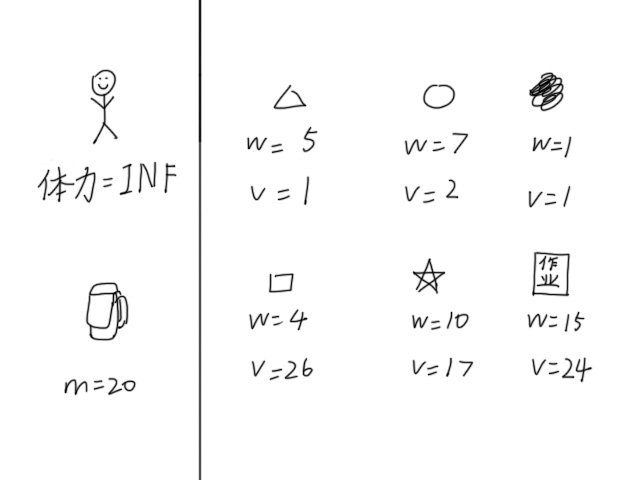
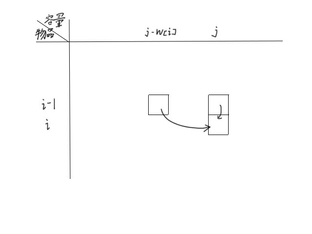
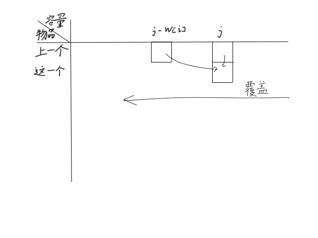

---
### 知识前置
你需要知道DP是[什么东西](/2024/03/05/Dynamic-Programming/)，同时你需要背过包。

---
### 题目描述
李华有一个背包，他想往背包里放一些东西，使得价值最大。李华的背包有容量限制，所以他并不能装下所有的东西，也就说有一些东西需要被舍弃掉。  
  
有$n$件物品和一个容量为$m$的背包，第$i$件物品的重量为$w_i$，价值为$v_i$。求选若干物品放入背包，背包内物品价值总和最大值。满足$w_i>0$。

---
### 暴力算法
不难想到，可以暴力枚举每一件物品是否放置。对于每一种合法的物品选取方案的价值总和求最大值。时间复杂度$O(2^n)$。  
在一秒内，这种算法最多只能过$n\le26$的数据，然后挂了。

容易想到，可以删去那些价值为$0$或重量超过背包容量的物体。但优化效果不显著，该挂的分还是得挂。

---
### 动态规划
对于每一个物品，只有取和不取两种状态。同时，在物品取之后只有剩余容量和已取价值受到影响。所以可以考虑使用DP求解。

#### 状态设置
设$f[i][j]$表示前$i$种物品放入背包容量为$j$的背包中得到的最大价值。

#### 初始值
容量为$0$的背包啥也放不下，不能获得任何价值，所以$f[i][0]=0$。  
啥也不放的背包不能获得任何价值，所以$f[0][j]=0$。

#### 状态转移
对于第$i$件物品，剩余空间为$j$时：

1.如果物品能放得下，即$j\ge v[i]$时，物品放不放都可以。  
如果不放这个物品，剩余容量和价值相较上一个物品都没有变化，所以$f[i][j]=f[i-1][j]$。  
如果放这个物品，相较上一个物品，剩余容量将会减少$w[i]$，价值将会增加$v[i]$，所以$f[i][j]=f[i-1][j-w[i]]+v[i]$。  
为最大化物品总价值，上述两个取最大值更新$f[i][j]$。

2.如果物品不能放得下，即$g<v[i]$时，物品就一定不能被放下。  
此时状态只能从上一个物品转移，即$f[i][j]=f[i-1][j]$。

所以$f[i][j]=
\begin{cases}
f[i-1][j],&j<v[i]\\\\
max\{f[i-1][j],\ f[i-1][j-w[i]]+v[i]\},&j\ge v[i]
\end{cases}$

#### 答案
显然，最终答案是所有物品被判断且所有容量被用完时的最大价值，即$f[n][m]$。

---
### 代码
```cpp
// w[N], v[N], f[N][M];
for (int i=1; i<=n; ++i) {
	for (int j=1; j<=m; ++j) {
		f[i][j]=f[i-1][j];
		if (j>=w[i]) f[i][j]=max(f[i][j], f[i-1][j-w[i]]+v[i]);
	}
}
printf("%d\n", f[n][m]);
```

---
### 滚动数组优化
将状态转移中的$f$数组画出来，如图所示。  
  
可以发现，对于任意一个物品，其状态都是上一行转移过来的，且在正上方或上一行的左方。  
于是我们可以删去一维，只保留一维数组，存储上一个物体的状态，如图所示。  
  
注意，此时循环必须从右侧开始，因为状态转移依赖左边的数据，复写掉就找不回来了。

此时$f[j]=
\begin{cases}
f[j],&j<v[i]\\\\
max\{f[j],\ f[j-w[i]]+v[i]\},&j\ge v[i]
\end{cases}$

---
### 代码
```cpp
// w[N], v[N], f[M];
for (int i=1; i<=n; ++i) {
	for (int j=m; j>=1; --j) {
		if (j>=w[i]) f[j]=max(f[j], f[j-w[i]]+v[i]);
	}
}
printf("%d\n", f[m]);
```

---
### 练习
板子题 [NOIP2005 普及组] 采药  
[题目传送门](https://www.luogu.com.cn/problem/P1048)
```cpp
#include <cmath>
#include <ctime>
#include <cstdio>
#include <cstdlib>
#include <cstring>
#include <iostream>
#include <algorithm>
using namespace std;
typedef long long ll;

char buf[1<<20], *p1, *p2;
#define getchar() (p1==p2&&(p2=(p1=buf)+fread(buf,1,1<<20,stdin),p1==p2)?0:*p1++)

inline ll read() {
	ll x=0, f=1;
	char ch=getchar();
	while (ch<'0'||ch>'9') {if (ch=='-') f=-1;ch=getchar();}
	while (ch>='0'&&ch<='9') {x=(x<<3)+(x<<1)+(ch^48);ch=getchar();}
	return x*f;
}

#define N 110
#define M 1010
int n, m, w[N], v[N], f[M];
bool vis[N];

signed main() {
	m=read(), n=read();
	for (int i=1; i<=n; ++i) w[i]=read(), v[i]=read();
	for (int i=1; i<=n; ++i) {
		for (int j=m; j>=1; --j) {
			if (j>=w[i]) f[j]=max(f[j], f[j-w[i]]+v[i]);
		}
	}
	printf("%d\n", f[m]);
	return 0;
}

```
