---
### 前言
这是一道物理题，是初高衔接课材料里的题；老师却不讲，因为它严重超纲。  
拍照搜题搜不到，于是我决定自己做。找寻答案的过程一波三折，很有参考价值。我把这道题的完整结题过程记录了下来，方便大家学习。  
在此特别感谢[硕硕](https://wild-donkey.github.io/)和学校物理老师们给予的帮助！

---
### 题目
如图所示，所有电阻的阻值都等于$R$，求A、B间的等效电阻。  
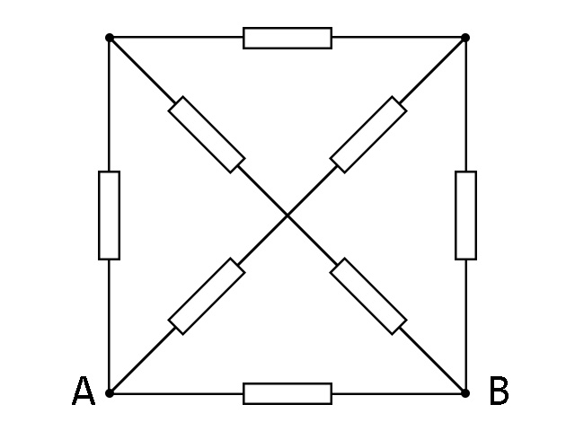  
注意：中间没有连接，注意观察圆点。

---
### 思路过程
特别说明：以下三个思路都是**错的**，请移步**正解**找寻答案，这里只是简单说明思路过程。  
变量命名不标准，没有按照题目要求，请见谅。

#### 错误解法1 - Dijkstra
思路来自[\_\_Algo\_3F\_\_](https://codeforces.com/profile/__Algo_3F__)。  
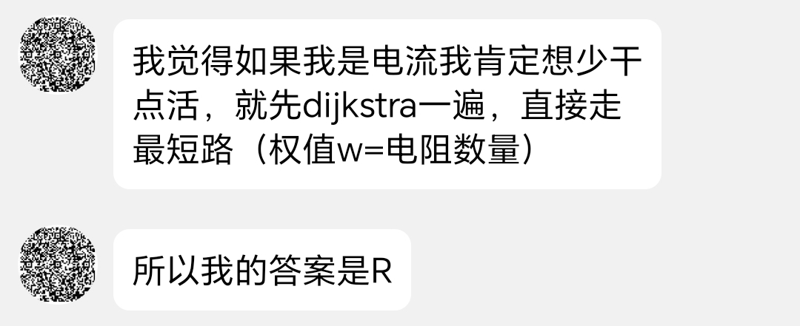  
显然，这个答案小于$R$，因为有电流通过上面的电路中。

#### 错误解法2 - 节点法
首先，我先用节点法尝试了一下。  
标记电势，考虑到已经有了A、B，使用小写字母代替，电势由高到低分别标记为$a\rightarrow b\rightarrow c\rightarrow d$。  
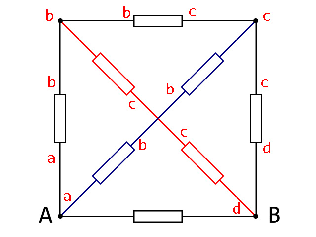  
不难发现，此时电路变为了三段并联。其中，$a\rightarrow d$先并联了一个单独的电阻，然后$a\rightarrow b$中有两个电阻，$b\rightarrow c$中有三个电阻，$c\rightarrow d$中有两个电阻。  
那答案就迎刃而解了，ab段电阻$\frac{1}{2}R$，bc段电阻$\frac{1}{3}R$，cd段电阻$\frac{1}{2}R$，ad两个支路分别为$\frac{4}{3}R$和$R$，并起来一共$\frac{4}{7}R$。  
显然，这道题不是这么简单的。注意看，在刚才的过程中，我们将所有连接b、c两个电势的都视作了并联，但事实上在中间交叉的电阻中，中间交点并不与其他等电势的地方相接。倒回去，如果按照这个思路，电路图应该如下图所示，其中颜色与上图对应。  
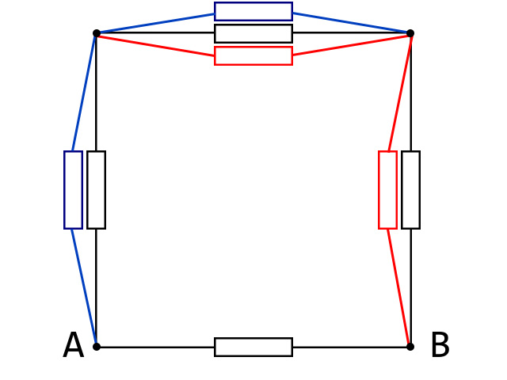  
我们无法证明这种方法的正确性，因为这种方法多连了两根导线，把电阻扯到一边去了，相当于分摊了电流。因此这个答案不一定是正确的。经过后续计算得知，这种方法是错误的。

#### 错误解法3 - 对称性
接下来尝试化简电路，化简结果如下，其中最中间奇怪方式连接的电阻是原图中最上面的与AB平行的电阻。  
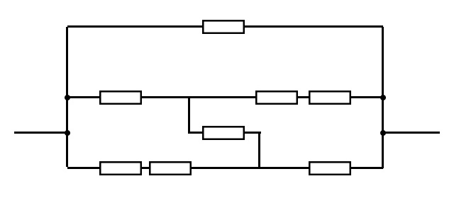  
然后就没有然后了，接下来问的硕硕才知道解法。  
显然，最上面的电阻是并联进去的，所以先不考虑，先把下面复杂的单独拆出来。根据对称性，上下两个支路电流相等，所以设总电流为$I$，则每条支路的电流都为$\frac{I}{2}$，如图所示。  
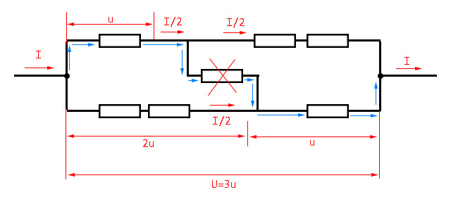  
因为每个电阻是相等的，设每个电阻为$r$，总电阻为$R$。设总电压为$U$，根据对称性设左上和右下电阻为$r$，则左下右上电阻为$2r$，因为电流相等，电阻为二倍，所以电压为二倍。  
这样列出等量关系式$U=3u$，$r=\frac{u}{\frac{I}{2}}=\frac{2u}{I}$，$R=\frac{U}{I}=\frac{3u}{I}=\frac{3}{2}\times\frac{2u}{I}=\frac{3}{2}r$  
所以这段电路的总电阻是单个电阻的$\frac{3}{2}$倍，和之前单拎的电阻并联起来就是$\frac{1}{\frac{2}{3r}+\frac{1}{r}}=\frac{3}{5}r$  
就这么结束了，我和硕硕都觉得这是个完美的解法。然而我们忽略了一个关键点：没考虑中间电阻，即没考虑标蓝的电流。这个电流的加入会导致左上、右下电流增加，导致电压不为二倍。  
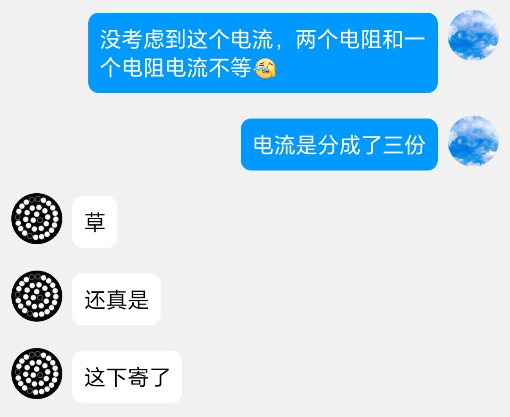

#### 错误解法4 - 等电流
按照分电流的思路继续往前走，我们发现在这个复杂电路中共有三条电流，如图是这三条电流分别途径的电路。  
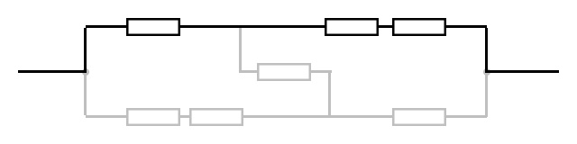  
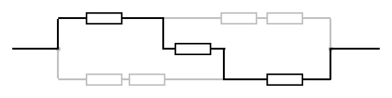  
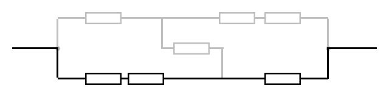  
不难看出，这三条电路的电阻相等，电压相等都等于电源电压，所以电流也相等，相当于三个等流并联，得到这部分电阻为$R$，再并上单个的电阻，总电阻为$\frac{1}{2}R$。  
很简单，很直接，但这个思路是错的。硕硕说欧姆定律的应用条件是闭合电路，但这个电路不闭合，所以不能推出等流这一结论。

---
### 正解
正解由硕硕提供，我整理的过程稍微有些不规范。  
思路：列方程求出中间电流，进而求出总电流和总电压的关系。

首先考虑下面复杂电路的电阻，将直接连接$AB$的电阻分开，剩下电路化简如下。  
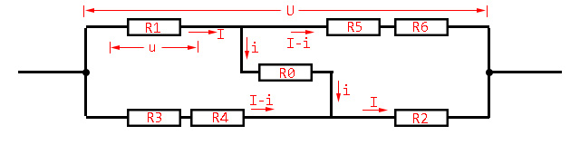  
设这部分电路总电压为$U$，通过$R_1$的电流为$I$，通过$R_0$的电流为$i$，$R_1$两端电压为$u$。  
由对称性可得，$I_{R_2}=I$，$U_{R_2}=u$。  
因为$R_0$与$R_5$、$R_6$一起分走$R_1$电流，所以$I_{R_5}=I_{R_6}=I_{R_1}-I_{R_0}=I-i$。$I_{R_3}$、$I_{R_4}$由对称性也可得。故该段电路总电流$I_{sum}=I_{R_1}+I_{R_3}=2I-i$  
因为$R_1$、$R_5$和$R_6$构成串联，所以$U_{R_5}+U_{R_6}=U-U_{R_1}=U-u$。因为$R_5=R_6$，根据正比分压可得$U_5=U_6=\frac{U-u}{2}$。$U_{R_3}$、$U_{R_4}$由对称性也可得。  
因为$R_1$、$R_0$和$R_2$构成串联，所以$U_{R_0}=U-U_{R_1}-U_{R_2}=U-2u$。

由此，所有电阻的电流电压均已得，故可求电阻：  
$U_{R_0}=U-2u,\ I_{R_0}=i,\ R_0=\frac{U-2u}{i}$  
$U_{R_1}=u,\ I_{R_1}=I,\ R_1=\frac{u}{I}$  
$U_{R_2}=u,\ I_{R_2}=I,\ R_2=\frac{u}{I}$  
$U_{R_3}=\frac{U-u}{2},\ I_{R_3}=I-i,\ R_3=\frac{U-u}{2I-2i}$  
$U_{R_4}=\frac{U-u}{2},\ I_{R_4}=I-i,\ R_4=\frac{U-u}{2I-2i}$  
$U_{R_5}=\frac{U-u}{2},\ I_{R_5}=I-i,\ R_5=\frac{U-u}{2I-2i}$  
$U_{R_6}=\frac{U-u}{2},\ I_{R_6}=I-i,\ R_6=\frac{U-u}{2I-2i}$  
$U_{sum}=U,\ I_{sum}=2I-i,\ R_{sum}=\frac{U}{2I-i}$

因为每个电阻都相等，得$R_0=R_1=R_3$，即$\frac{U-2u}{i}=\frac{u}{I}=\frac{U-u}{2I-2i}$，解得$i=\frac{1}{3}I$。将其代入，得$\frac{U-2u}{i}=\frac{u}{3i}=\frac{U-u}{4i}$，解得$U=\frac{7}{3}u$  
$R_{sum}=\frac{U}{2I-i}=\frac{\frac{7}{3}u}{\frac{5}{3}I}=\frac{7}{5}\times\frac{u}{I}=\frac{7}{5}R_2=\frac{7}{5}R$  
故这段电路的总电阻为$\frac{7}{5}R$，再与原先阻值为$R$的电阻并联，得到$\frac{1}{\frac{5}{7R}+\frac{1}{R}}=\frac{7}{12}R$  
故答案为$\frac{7}{12}R$

---
### 总结
硕硕的一句话足以概括  

---
### 尾声
结束了，题做出来了。  
硕硕说，这个题目很有意思，让他想起了中学物理的知识。  
我觉得这个题目挺难的，但有意思的地方在解题思路上。一次一次的错误，一次一次的改正。如果这个题给我在考试里做，我可能直接就放弃了，也不会这么曲折地做出来。当然最终找到答案也是十分开心的。

最后硕硕提出用模拟软件校验一下，相差不大，所以这个答案应该是对的。  
如果你认为这个答案不对，欢迎指出，万一这个答案也是错误的呢？也许这个思路也会成错误解法之一。
