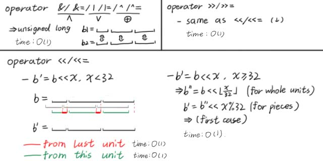

---
### 写在前面
本文仅介绍了C++14版本下的特性和调用方法，仅供 $\text{OIer}$ 学习和参考使用。

具体怎么使用，哪些题、什么环境下使用，后面我会单独写一篇文章讲。在此之前，建议看一下大佬的博客，我会放在后面。

---
### std::bitset
一种数据类型，可用于压二进制。
#### 头文件
`#include <bitset>`
#### 顺序
右侧为低位，左侧为高位，类似二进制数。

以`bitset<6> b(22)`为例：
$$
\begin{array}{|c|c|c|c|c|c|c|}
\hline \text{val}&0&1&0&1&1&0\\\\
\hline \text{id}&5&4&3&2&1&0\\\\
\hline
\end{array}
$$
#### 构造
构造一个长度为 $N$ 的`bitset`。

`bitset<N> b;`  
默认构造，所有位都为 $0$。

`bitset<N> b(x);`  
从`unsigned long long`类型构造，最右、最低位有效。  
有效长度为 $\min(N,64)$。若 $N<64$，则取 $x$ 的低 $N$ 位作为`bitset`的数据。

`bitset<N> b(s);`  
从`std::basic_string`或`const Char T*`类型构造，最左、最高位有效。  
有效长度位 $\min(N,len)$。若 $N<len$，则取字符串 $s$ 从左向右前 $N$ 位作为`bitset`的数据。  
若 $s$ 中含有除“$0$”、“$1$”之外的字符，会在构造过程中报错。
#### 值的获取
`bool x=b[i];`  
直接获取下标为 $i$ 的位值，即从右向左第 $i-1$ 位。

`bool x=b.test(i);`  
直接获取下标位 $i$ 的位值，但越界会报错。

`bool x=b.all();`  
若 $b$ 中全部为 $1$，则返回 $1$，若存在 $0$ 则返回 $0$。

`bool x=b.any();`  
若 $b$ 中存在 $1$，则返回 $1$，若全部为 $0$ 则返回 $0$。

`bool x=b.none();`  
若 $b$ 中全部为 $0$，则返回 $1$，若存在 $1$ 则返回 $0$。

`size_t x=b.count();`  
返回 $b$ 中 $1$ 的数量，即 $\text{popcount}$。

`cout << b << '\n';`  
输出 $b$。从左到右，由高位到低位，下标由 $N-1$ 到 $0$。
#### 值的修改
`b[i]=x;`  
将下标为 $i$ 的位修改为 $0/1$。

`b.set(i);`  
将下标为 $i$ 的位修改为 $1$。

`b.reset(i);`  
将下标为 $i$ 的位修改为 $0$。

`b.flip(i);`  
将下标为 $i$ 的位反转，从 $0$ 改成 $1$，从 $1$ 改成 $0$。
#### 运算符
同二进制位运算，`bitset`提供了`<<`、`<<=`、`>>`、`>>=`、`&`、`&=`、`|`、`|=`、`~`等运算符。  
位移产生的新位为 $0$。  

注意，`bitset`仅能与`bitset`运算，不可与整型运算。

---
### 时间复杂度
#### 对于整型
在现代CPU中，两个 $32$ 位无符号整型进行位运算的时间复杂度为 $O(1)$，而不是 $O(32)$。其原因有以下三点：
1. 硬件支持：现代CPU的指令集通常包含专门的位运算指令，这些指令直接由硬件支持，执行速度非常快。
2. 寄存器操作：位运算通常在CPU的寄存器之间进行，寄存器访问速度非常快，远快于内存访问。
3. 编译器优化：现代编译器能够识别并优化位运算，生成高效的机器代码。

整型变量间单次位运算的时间复杂度为 $O(1)$，这是分析时间复杂度的**大前提**，也是`bitset`能优化时间复杂度的**根本原因**。
#### 对于bitset
`bitset`的底层是`unsigned long`$32$ 位无符号整型变量，`bitset`间的位运算全部由底层的`unsigned long`实现。

`bitset`位运算的具体操作如下图所示。  
  
这样，进行**每一个`unsigned long`单位内位运算**的时间复杂度为 $O(1)$；而长度为 $N$ 的`bitset`总共有 $\lceil\frac N{32}\rceil$ 个`unsigned long`单位，故**整个`bitset`进行位运算**的时间复杂度为 $O(\frac N{32})$。

这种记法不是很严谨。考虑到时间复杂度不应出现常数，应将其记为 $O(\frac Nw)$，其中位数 $w=32$。

当然，如果使用`unsigned long long`作为底层类型，常数能降至 $\frac1{64}$，但是**需要手写**。

---
### 博客链接 - bitset的应用
bitset 的妙用：乱搞字符串匹配 - [博客园-Alex_Wei](https://www.cnblogs.com/alex-wei/p/bitset_yyds.html)  
bitset的用法及例题(对DP过程的优化) - [博客园-yangtz](https://www.cnblogs.com/-ytz/p/16614693.html)

---
### 参考资料
std::bitset - [cppreference](https://zh.cppreference.com/w/cpp/utility/bitset)  
bitset - [OI-Wiki](https://oi-wiki.org/lang/csl/bitset/)
