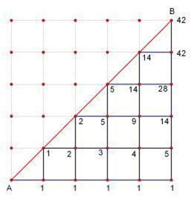

---
### 知识前置
#### 排列组合
详见[OI-Wiki](https://oi-wiki.org/math/combinatorics/combination/)，后面会出一篇文章专门讲。
#### 栈
先进先出的数据结构，详见[OI-WIki](https://oi-wiki.org/ds/stack/)。
#### 二叉搜索树
**左子树**点权均**小于**根节点，**右子树**点权都**大于**根节点的二叉树。  
它有很多好的性质，详见[OI-Wiki](https://oi-wiki.org/ds/bst/#%E5%AE%9A%E4%B9%89)。

---
### 解决问题
以下问题的答案**都可以**用 $\text{Catalan}$ 数 $H_n$ 表示。
#### 一、进出栈问题
一个容量无穷大的栈，若进栈序列为 $1,2,3,\dots,n$，求共有多少种不同的出栈序列。

进一步，这个问题可以扩展为：  
给定 $n$ 对括号，求合法配对的序列数。

#### 二、凸多边形三角划分问题
在凸 $n$ 变形中，连接 $n-3$ 对不相邻顶点，使原多 $n$ 边形划分为 $n-2$ 个三角形，求划分方案数。  
  

进一步，这个问题可以扩展为：  
在圆上选择 $2n$ 个点，求使用 $n$ 条不相交线段连接这些点的方案数。
#### 三、二叉树
给定 $n$ 个有不同**序号**的节点，求能构成的不同的二叉搜索树的个数。  
或，给定 $n$ 个**无序号**节点，求能构成的不同的二叉树的个数。
#### 四、矩阵路径问题
在大小 $n\times n$ 的矩阵中，从起点 $(0,0)$ 走到终点 $(n,n)$，且不可走到对角线 $y=x$ 上方，求不同的路径条数。  
  

---
### 定义
设 $H_n$ 表示 $\text{Catalan}$ 数列中的第 $n$ 项，则有：
$$
\begin{array}{ccccccc}
H_0&H_1&H_2&H_3&H_4&H_5&H_6\\\\
\hline 1&1&2&5&14&42&132
\end{array}
$$
满足递推式及通项公式：
$$
\begin{gathered}
H_0=1, H_1=1,\ H_{n+1}=\sum_{i=0}^nH_i\times H_{n-i}\\\\
H_n=\frac{\begin{pmatrix}2n\\\\n\end{pmatrix}}{n+1}
\end{gathered}
$$

---
### 其他公式
$$
\begin{align}
H_n=\frac{H_{n-1}(4n-2)}{n-1}\\\\
H_n=\begin{pmatrix}2n\\\\n\end{pmatrix}-\begin{pmatrix}2n\\\\n-1\end{pmatrix}
\end{align}
$$
一般地，在程序设计中，通常使用公式 $H_n=\frac{H_{n-1}(4n-2)}{n-1}$，而手算通常采用公式 $H_n=\frac{\begin{pmatrix}2n\\\\n\end{pmatrix}}{n+1}$。

---
### 例题
[洛谷P1044](https://www.luogu.com.cn/problem/P1044) 栈
#### 题目描述
一个容量无穷大的栈，若进栈序列为 $1,2,3,\dots,n$，求共有多少种不同的出栈序列。
#### 代码
[AC](https://www.luogu.com.cn/record/166261131) 680.00KB 15ms
```cpp
#include <cmath>
#include <cstdio>
#include <cstring>
#include <iostream>
using namespace std;
typedef long long ll;

char buf[1<<20], *p1, *p2;
#define getchar() (p1==p2&&(p2=(p1=buf)+fread(buf,1,1<<20,stdin),p1==p2)?0:*p1++)

inline ll read() {
	ll x=0, f=1; char ch=getchar();
	while (ch<'0'||ch>'9') {if (ch=='-') f=-1; ch=getchar();}
	while (ch>='0'&&ch<='9') x=(x<<1)+(x<<3)+(ch^48), ch=getchar();
	return x*f;
}

#define N 30
ll n, h[N];

signed main() {
	// freopen("a.in", "r", stdin);
	n=read(), h[0]=1;
	for (ll i=1; i<=n; ++i) h[i]=h[i-1]*(i*4-2)/(i+1);
	printf("%lld\n", h[n]);
	return 0;
}

```

---
### 总结
注意事项：$\text{Catalan}$ 数列的前 $6$ 项 $1,2,5,14,42,132$ 在考 $\text{CSP-J1/S1}$ 前是要背过的。

在赛场上，不论是初赛还是复赛，你都不一定能看得出一道题是卡特兰数。  
遇到排列组合题目，如果普通方法算不出来，优先往上面四种基本模型上套，看看是不是卡特兰数。

---
### 参考资料
卡特兰数 - [OI-Wiki](https://oi-wiki.org/math/combinatorics/catalan/)  
卡特兰数 - [百度百科](https://baike.baidu.com/item/%E5%8D%A1%E7%89%B9%E5%85%B0%E6%95%B0/6125746)
