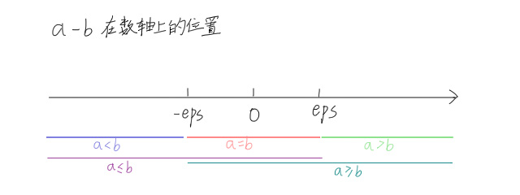

---
### 写在前面
不会用$eps$请不要担心，这是高阶算法内容。  
就算没有判或判错了很大可能只影响算法复杂度，最多多跑一层，无需担心。  
但是某些特定情况下需要特别关注$eps$，不过这是极少数情况。

这篇文章很长，如果只是想了解一下$eps$，不追求理解原理，请前往[解决方案](../Detailed-Explanation-of-EPS/#解决方案)一节，或在[洛谷剪贴板](https://www.luogu.com.cn/paste/ox2b3zgd)中查看。

---
### 引言
Taoran第一次见到$eps$是在李超树模板里。
```cpp
#define N 100010
#define eps 1e-8
#define LS (p<<1)
#define RS ((p<<1)+1)

struct line {
	double k, b;
	int id;
	line() {}
	line(double x0, double y0, double x1, double y1, int _id) {
		id=_id;
		if (abs(x1-x0)<eps) k=0, b=max(y0, y1);
		else k=(y1-y0)/(x1-x0), b=y0-k*x0;
	}
	double val(double x) {return k*x+b;}
} t[N<<2];

void insert(int p, int pl, int pr, int l, int r, line y) {
	int mid=(pl+pr)>>1;
	if (l<=pl&&pr<=r) {
		if (t[p].id==0) {t[p]=y; return;}
		if (abs(t[p].val(mid)-y.val(mid))<eps) {
			if (t[p].id>y.id) swap(t[p], y);
		}
		else if (t[p].val(mid)<y.val(mid)) swap(t[p], y);
		if (t[p].val(pl)<y.val(pl)+eps) insert(LS, pl, mid, l, r, y);
		if (t[p].val(pr)<y.val(pr)+eps) insert(RS, mid+1, pr, l, r, y);
		return;
	}
	if (l<=mid) insert(LS, pl, mid, l, r, y);
	if (r>=mid+1) insert(RS, mid+1, pr, l, r, y);
}

line ask(int p, int pl, int pr, int x) {
	if (pl==pr) return t[p];
	int mid=(pl+pr)>>1;
	line res;
	if (x<=mid) res=ask(LS, pl, mid, x);
	else res=ask(RS, mid+1, pr, x);
	if (abs(res.val(x)-t[p].val(x))<eps) {
		if (res.id<t[p].id) return res;
		else return t[p];
	} else {
		if (res.val(x)>t[p].val(x)) return res;
		else return t[p];
	}
}

```
$eps$出现在`line`、`insert`和`ask`这三个函数的`double`关系判断中。

---
### 知识前置
#### C++中的浮点类型
详见[OI-Wiki](https://oi-wiki.org/lang/var/#%E6%B5%AE%E7%82%B9%E7%B1%BB%E5%9E%8B)。
#### 小数部分的进制转换
自己学去。

---
### double类型的内存
我们可以使用下面这段程序查看`double`类型的内存。  
输入一个小数，输出它精确到小数点后40位的存储，及所存储的64bit数据。  
这里借助`union`结合体将`double`类型的内存共享给空间大小相等的`long long`类型，再使用位运算逐位输出。
```cpp
#include <cstdio>
using namespace std;
typedef long long ll;

union tmp {
	double d;
	ll l;
} t;

ll ans[100];

signed main() {
	scanf("%lf", &t.d);
	printf("%.40lf\n", t.d);
	for (int i=1; i<=64; ++i) ans[65-i]=t.l&1, t.l>>=1;
	for (int i=1; i<=64; ++i) printf("%lld", ans[i]);
	return 0;
}

```
本篇文章中，将以$11.25$与$11.3$为例解释。

---
### C++中的小数存储
在C++中，不论是`float`、`double`还是`long double`，它们都是以科学计数法的形式存储小数的。  
举个例子，$11.25$用科学计数法可以表示成$1.125\times10^{-1}$，用二进制可以表示成$(1011.01)_2$，而在计算机中它被表示成$(1.01101)_2\times2^3$。

---
### 理想状态
$11.25$精确到小数点后$40$位的输出：$11.2500000000000000000000000000000000000000$  
$010000000010\ 0110100000000000000000000000000000000000000000000000$  
前$16$位为$2$的次幂，后$48$位为小数部分。  
注意，为节省空间，小数部分被省去了第一个$1$，只存储$.01101$。

显然，$11.25$根本难不倒`double`，输出小数点后40位依然正确。这是因为$0.25$恰好能被有限位二进制小数表示。但如果换一个呢？

---
### 爆精度
$11.3$精确到小数点后$40$位的输出：$11.3000000000000007105427357601001858711243$  
$0100000000100110\ 100110011001100110011001100110011001100110011010$

出问题了，$11.3$的小数部分$0.3$并不能被二进制小数表示尽，出现循环，而计算机存储的数据量是有限的，从而导致精度下降。  
小数在C++中，有时并不能被精确表示。

---
### 大小判断缺陷
我们做一个实验。  
两数$a$、$b$初始值均为$11.3$，其中$b$加上一个数后再减去，判断两数是否相等。
```cpp
#include <cstdio>
using namespace std;
typedef long long ll;

union tmp {
	double d;
	ll l;
} a, b;

ll ans[100];

signed main() {
	a.d=b.d=11.3;
	b.d+=21.0426;
	b.d-=21.0426;
	puts((a.d==b.d)?"True":"False");
	printf("%.40lf\n", a.d);
	for (int i=1; i<=64; ++i) ans[65-i]=a.l&1, a.l>>=1;
	for (int i=1; i<=64; ++i) printf("%lld", ans[i]); puts("");
	printf("%.40lf\n", b.d);
	for (int i=1; i<=64; ++i) ans[65-i]=b.l&1, b.l>>=1;
	for (int i=1; i<=64; ++i) printf("%lld", ans[i]); puts("");
	return 0;
}

```
输出：
```
False
11.3000000000000007105427357601001858711243
0100000000100110100110011001100110011001100110011001100110011010
11.3000000000000042632564145606011152267456
0100000000100110100110011001100110011001100110011001100110011100
```
结果令人吃惊，变化后两数不相等。  
仔细看数据就会发现，内存的**最后三位**发生了变化。$010\rightarrow100$，正是这小小的变化改变了C++对于小数的判断。

这意味着，C++没有相等容忍区间，任何一点小的变动都会影响到大小判断。

---
### 解决方案
既然C++本身没有容忍区间，我们可以给它加上一个。

设一个常数$eps=1\times10^{-8}$，通常认为：  
$a=b\Rightarrow a-b\in [-eps,\ eps]$  
$a>b\Rightarrow a-b> eps$  
$a\ge b\Rightarrow a-b\ge-eps$

带着图简单理解一下：  
  

---
### 总结
由于C++浮点数储存原理的缺陷，浮点数的精度不能保证，在关系判断中精度差会导致判断错误。  
一般来说，浮点类型的大小关系判断需要使用$eps$给定宽容区间，否则算法会出现错误，导致更高的时间复杂度甚至错误答案。
