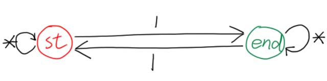
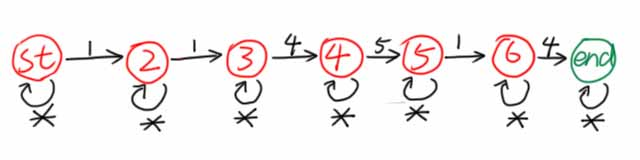
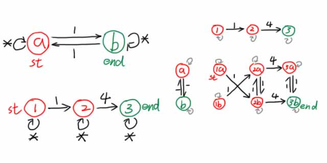
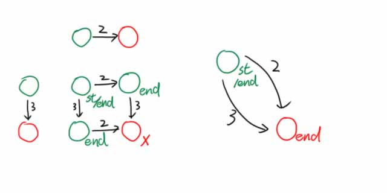

---
### 写在前面
因本文叙述过于简略和不标准，在阅读本文之前，你需要看一眼[OI-Wiki](https://oi-wiki.org/string/automaton/)，并阅读[这篇文章](../Deterministic-Finite-Automaton)及其它相关文章，以对DFA有一个初步的认识，并掌握DFA的基础理论知识与形式化描述方法。

---
### 知识前置
#### 子串与子序列
子串是连续的，子序列可以不连续。
#### 集合的对称差
对称差是集合论的一个概念，描述两个集合之间的关系。  
两个集合取对称差会得到一个集合，其符号与运算法则如下：
$$
A\oplus B=(A\cup B)-(A\cap B)
$$
对称差记录了两个集合中不同的元素。

---
### 什么是有限状态自动机
一种能在集合内识别特定语言的结构，确定有限状态自动机。

可以视作一个路线，根据信息沿着边在DFA上走。
#### 状态
DFA有两种状态：拒绝状态和接受状态。在拒绝状态下，答案不可取。  
需要注意，拒绝状态和接受状态是可以转化的，并不是走到拒绝状态就说明不成立。

在本文的图片中，接受状态使用绿色节点表示，拒绝状态使用红色节点表示。
#### 转移
DFA的不同状态间是可以转移的。只要新传入的数据满足转移条件，就可以从一个节点转移到另一个节点。  
特别地，当传入的数据对当前节点的所有转移状态都不满足时，它满足通配符`*`，可以从这里转移。有时省略，表示转移到自身，不改变状态。

---
### 举个例子
下面这个自动机可以用于判断字串是否含有奇数个字符“$1$”。  
  
如图所示，一共两种状态，且仅能通过“$1$”转移。每读入一个“$1$”就转移一次状态，奇数次在状态 $\text{end}$，偶数次在状态 $\text{st}$。  
读入其它字符时不转移，表示其它字符不影响字符“$1$”的奇偶性。

下面这个自动机可以用于判断字串中是否含有子序列“$114514$”。  
  
仿照上面的例子也不难理解，这里不做解释。

这个东西叫子序列自动机，可以 $O(n)$ 判断一个长度为 $n$ 的数列是否含有子序列“$114514$”。

---
### DFA间的运算
使用笛卡尔积实现。
#### DFA的交
假设我们需要实现判断一个字串是否同时满足：
1. 包含奇数个字符“$1$”；
2. 有子序列“$14$”。

一种朴素的想法是，先跑一遍判断奇数个“$1$”的自动机(上面有)，再跑一边子序列自动机。

能否将两个DFA整合到一个DFA中，跑一次同时判断两个条件？  
  
观察上面这个自动机，如果能从 $\text{st}$ 走到 $\text{ed}$，就表明同时满足以上两种条件。

程序化地求这个综合DFA的步骤如下：
1. 写出两个DFA；
2. 对于每一对转移进行合并：若在第一个DFA中有 $x_1\xrightarrow cy_1$，在第二个中有 $x_2\xrightarrow cy_2$，则在新的自动机上有 $(x_1,x_2)\xrightarrow c(y_1,y_2)$。
3. $(y_1,y_2)\leftarrow(y_1,y_2)\land y_1\land y_2$，即 $y_1$ 与 $y_2$ 必须同时为可接受状态，新DFA中的点才为可接受状态，否则为拒绝状态。（显然 $x$ 的状态我们不用管。）

我们称第 $2$ 个操作为求两个DFA的笛卡尔积。

再举一个例子，要判断一个字串既不包含“$2$”，又不包含“$3$”，只需构造下面的自动机：
  
注意到有两个状态是没用的，可合并掉，因此可以将新DFA写成右边的形式。
#### DFA的并
与上文相似。若有 $x_1\xrightarrow cy_1$、$x_2\xrightarrow cy_2$，则可连边 $(x_1,y_1)\xrightarrow c(y_1,y_2)$，其中$(y_1,y_2)\leftarrow(y_1,y_2)\lor y_1\lor y_2$。
#### DFA的对称差
与上文相似。若有 $x_1\xrightarrow cy_1$、$x_2\xrightarrow cy_2$，则可连边 $(x_1,y_1)\xrightarrow c(y_1,y_2)$，其中$(y_1,y_2)\leftarrow(y_1,y_2)\lor(\lnot y_1\land y_2)\lor(y_1\land\lnot y_2)$。

---
### DFA的存储
DFA中的一条转移边 $u\xrightarrow cv$ 可以记在二维数组 $f$ 中，$f_{u,c}=v$。

---
### DFA最小化
本蒟蒻还没学会，等学会了再来补吧。
