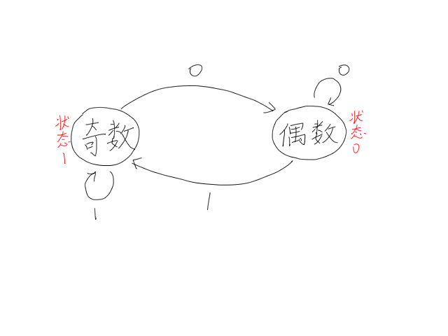

---
### 知识前置
#### 图灵机
一个设想中的机器，由图灵于1936年提出。  
详见[百度百科](https://baike.baidu.com/item/%E5%9B%BE%E7%81%B5%E6%9C%BA)。
#### 图论
自己学去。

---
### 定义
自动机是一个对信号序列进行判定的数学模型，也就是给一个状态能自己转移到下一个状态并进行运算的机器。

---
### 构成
$Q$：状态集，表示自动机里的每个状态，即图中的点。  
$\Sigma$：字符集。  
$F$：可接受状态集，即结束状态的结点。  
$q_0$：初始状态。  
$\delta$：转移函数，$Q\times\Sigma=Q'$

自动机从初始状态按转移函数转化，跑一定次数到答案状态，在可接受状态集内的即为答案。

---
### 实例
下面是一个判断二进制数奇偶的自动机，其中$Q=\lbrace0,\ 1\rbrace$，$\Sigma=\lbrace0,\ 1\rbrace$，$F=\lbrace0,\ 1\rbrace$，$q_0=0$，$\delta=\lbrace(0,0,0),\ (0,1,1),\ (1,0,0),\ (1,0,1)\rbrace$。  
  
在这个自动机中，读入一个二进制数，按照自动机进行操作，可以通过最终状态判断奇偶。
