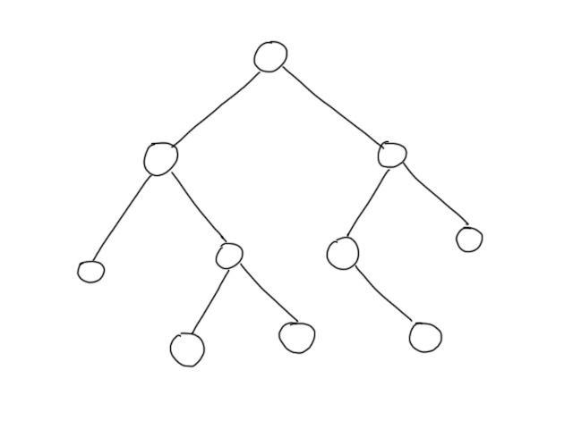
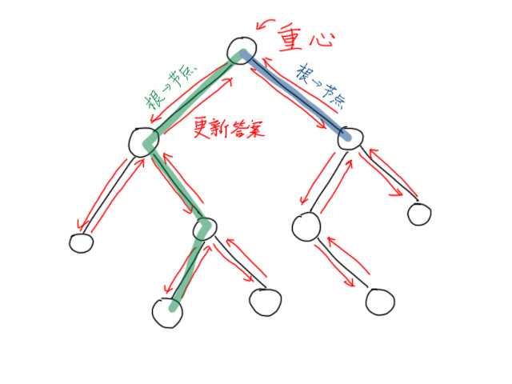
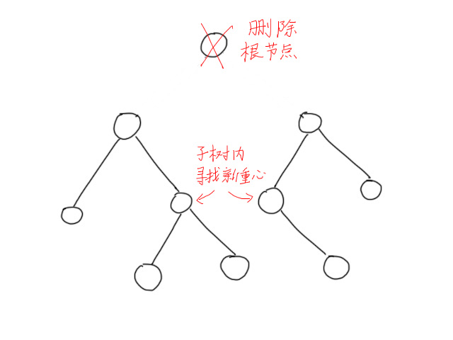

---
### 知识前置
#### 树
无环联通图，有唯一一个前驱。  
详见[OI-Wiki](https://oi-wiki.org/graph/tree-basic/)。
#### 树的重心
一个节点，使得删去它后所形成的最大子树最小。  
详见[OI-Wiki](https://oi-wiki.org/graph/tree-centroid/)。
#### 线段树
一个支持维护区间信息的数据结构。  
详见[OI-Wiki](https://oi-wiki.org/ds/seg/)。

---
### 写在前面
本文讲述得较为详细。如果只是想快速了解算法内容，请前往[OI-Wiki](https://oi-wiki.org/graph/tree-divide/#%E7%82%B9%E5%88%86%E6%B2%BB)。  
本篇文章就无根树进行说明。

---
### 算法适用条件
解决带权树上路径统计相关问题。    
时间复杂度$O(n\log n)$，空间复杂度$O(n)$。

---
### 算法原理
以这样一棵树为例：  
  
先随便指定一个根节点。  
显然，对于每条树上的路径，我们可以分为两种。一种时经过根节点的，另一种是不经过根节点的。

对于每条经过根节点的路径$u\rightarrow v$，我们将其拆为两段，分别为$u\rightarrow root$和$root\rightarrow v$，计算后再合并，即可得到答案。  
由此，可以处理根节点到每个节点的路径信息，再计算经过根节点的路径信息。

不经过根节点的路径一定全部在子树中。完成上述操作后，可将根节点删除，对每个子树内的问题进行求解。这样不经过根节点的路径一定会在后续操作中转化为经过子树根节点的路径，再通过上述过程可计算答案。

所有子树求解完后向上递归合并答案，结合经过根节点路径的答案和所有子树内路径的答案，即可得到所有路径的答案。

考虑最坏情况，树是一条链，根节点每次都选到链的一端，时间复杂度$O(n^2)$。

---
### 算法优化
不难发现，算法的时间瓶颈在于子树大小。子树越大，所能继续分的次数越多，树的总计算次数也越多。所以，被分开的每个子树应尽可能小。  
每次都取当前树的重心作为根节点，这样把树分开后所形成的最大子树会最小，从而减少总递归层数。

算法分为三步：  
1.找到当前树的根节点，计算根节点到各节点的答案，处理经过根节点的路径个数。  
  
2.统计完，将根节点删除，对子树进行求解。


这样总的递归层数不会超过$\log n$，时间复杂度$O(n\log n)$。

---
### 算法实现
几点注意事项：  
1.递归时需要删除根节点，用`vis`数组存储；  
2.数组删除时需要用队列存储后精准删除，使用`memset`或`for`循环会爆掉。


伪代码：
```cpp
void dfs2(int u, int fa) {
	ans+=solve(u, 0); // 经过根节点的答案
	vis[u]=1; // 删除根节点
	for (v:u.son) {
		if (v==fa||vis[v]) continue; // 父亲和被删除的节点都不访问
		ans-=solve(v, w); // 删除重复计算的边
		find_root(v, u); // 找重心
		dfs2(root, 0); // 分治
	}
}
```

---
### 总结
代码结构：
1.求重心 `dfs1`
2.求路径信息 `dfs2`
3.求解答案
