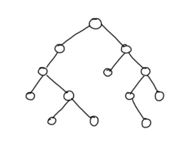
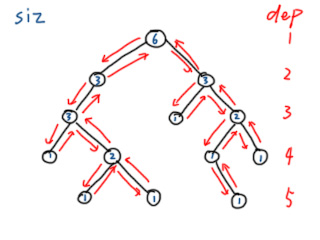
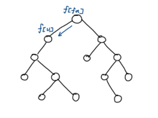
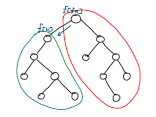

---
### 知识前置
#### 树
无环联通图，有唯一一个前驱。  
涉及换根DP问题的一般是无根树。  
详见[OI-Wiki](https://oi-wiki.org/graph/tree-basic/)。

---
### 定义
树形DP中的换根DP问题又被称为二次扫描，通常不会指定根结点，并且根结点的变化会对例如子结点深度和、点权和等一些值产生影响。  
通常需要两次DFS，第一次DFS预处理诸如深度，点权和之类的信息，第二次DFS开始运行换根动态规划。

---
### 题目特征
一般基于树上的问题或能转化成树上问题的，离线的且解法确定的，且需对每一个点作为根节点求解，时空复杂度在$1\times10^7$以内的可以考虑使用换根DP求解。  
同时，允许一个节点的状态从相邻节点转移。

---
### 一般思路
以这样一棵树为例。  
  
首先，任选一个节点作为根节点，使用DFS遍历整棵树并处理出下一步换根所需要的相关数据，同时对根节点求解。这里以常见的深度和子树大小为例。  
  
接下来，从根节点开始顺序遍历，用父节点更新子节点的答案。  
  
一般地，从父节点转移到字结点后，答案的更改可在子树内和子树外分别讨论。通常子树内一套、子树外一套，如图所示。例如计算$dep$和，子树内全部减$1$，而子树外全部加$1$。  
  
换根DP的一般思路：  
首先跑一遍DFS，由叶子结点向上，更新状态转移所需信息。再跑一边DFS，由根节点向下，计算每个节点作为根节点的答案。

---
### 伪代码
```cpp
// u -> current node
// v -> child node
void dfs1(u, fa) {
	// Initialize the required information.
	for (connected_nodes) {
		if (v==fa) continue;
		dfs1(v, u);
		// Update the required information.
	}
}

void dfs2(u, fa) {
	// Initialize the answer.
	for (connected_nodes) {
		if (v==fa) continue;
		// Update the answer.
		dfs1(v, u);
	}
}
```
