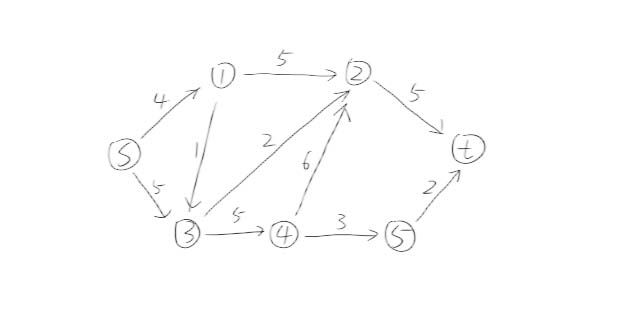
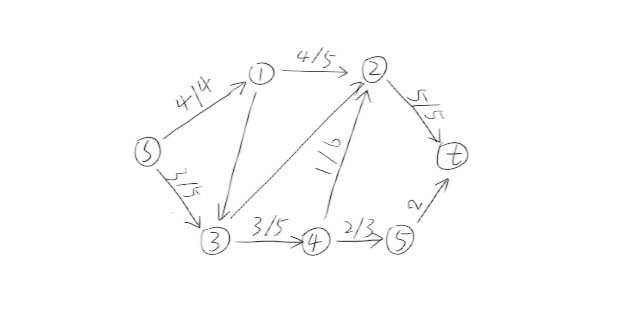
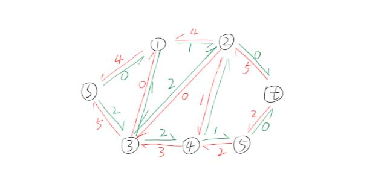
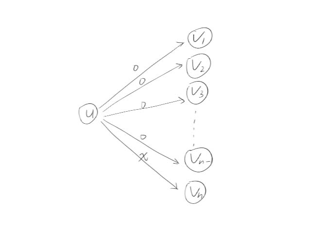
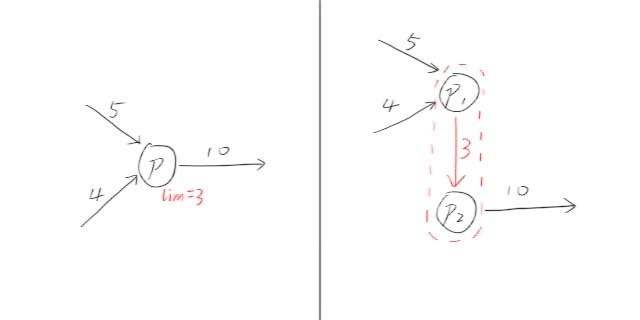

---
### 知识前置
#### 深度优先搜索(DFS)
基于深度的搜索，一搜到底，有回溯。详见[OI-Wiki](https://oi-wiki.org/search/dfs/)。
#### 广度优先搜索(BFS)
基于广度的搜索，逐层加深搜索。详见[OI-Wiki](https://oi-wiki.org/search/bfs/)。

---
### 写在前面
这部分讲的是增广路算法，预流推进算法还没写。

---
### 算法定义
在有向图中，给定源点$s$和汇点$t$，图上$s\rightarrow t$能流过的最大流量成为网络的最大流。  
其中，$u\rightarrow v$的流量$f(u,\ v)$满足$0\le f(u,\ v)\le w(u,\ v)$，即流量必须小于等于边权。

最大流算法就是求$s\rightarrow t$最大流的过程。

---
### 使用条件
问题可以通过建模转化为最大流问题。  
时间复杂度$O(n^2\times m)$，空间复杂度$O(n)$。

---
### 基本概念
#### 反向边
记录已使用流量和剩余流量，完成退流操作。

以下面这张图为例：  
  
在最大流下，我们在每条边上作$x/y$形式的标记，表示这条边最大流量为$y$，当前流量为$x$：  
  
建立反向边，流过去的加在反向边(红色)中，剩余流量在正向边(绿色)中：
  
这样建反向边，既能保留剩下的流量，便于寻找增广路，又能记录流过的方便退流。

查询反向边是有一个小技巧：从编号$0$开始建边，建完边有立刻建反向边，这样`编号^1`就是对应的反向边了。注意这样的话`head[]`数组需要全部设为$-1$，不能是$0$，同时反向边权值为$0$。
#### 增广路
一条路径，起点为$s$，终点为$t$，并且经过的各条边上的剩余容量均大于$0$。  
查询到增广路，意味着$s\rightarrow t$的流还可以更大。

---
### 一般增广路算法
又称Ford–Fulkerson增广，是最基础最简单的最大流算法。
#### 算法原理
每一次尝试找一条增广路，找到了就更新最大流。
#### 算法实现
步骤：  
1.DFS找一条增广路，记录路径的最大流$f$；  
2.在回溯过程中维护剩余容量，将当前边减去$f$，同时反向边加上$f$。  
3.重复以上步骤，直到不存在增广路。

由于每次都需要DFS查找增广路，并且一次只能处理一条增广路，效率很低。  
时间复杂度$O(m\times k)$，其中$k$为增广路个数。
#### 代码
例题 [洛谷P3376](https://www.luogu.com.cn/problem/P3376) 网络最大流模板  
84分，两个点会TLE。
```cpp
#include <cstdio>
#include <cstdlib>
#include <cstring>
#include <iostream>
using namespace std;
typedef long long ll;

char buf[1<<20], *p1, *p2;
#define getchar() (p1==p2&&(p2=(p1=buf)+fread(buf,1,1<<20,stdin),p1==p2)?0:*p1++)

inline ll read() {
	ll x=0, f=1;
	char ch=getchar();
	while (ch<'0'||ch>'9') {if (ch=='-') f=-1;ch=getchar();}
	while (ch>='0'&&ch<='9') {x=(x<<3)+(x<<1)+(ch^48);ch=getchar();}
	return x*f;
}

#define N 210
#define M 5010
#define INF 0x3f3f3f3f
#define v e[i].to
#define w e[i].val
int n, m, s, t, t1, t2, t3;
ll max_flow;
int head[N], tot, vis[N];
struct edge {int to, nxt, val;} e[M<<1];

void add_edge(int x, int y, int z) {
	e[tot]={y, head[x], z}, head[x]=tot++;
}

int dfs(int u, int minf) {
	if (u==t||minf==0) return minf;
	vis[u]=1;
	for (int i=head[u]; i!=-1; i=e[i].nxt) {
		if (w==0||vis[v]) continue;
		int f=dfs(v, min(minf, w));
		if (f<=0) continue;
		e[i].val-=f, e[i^1].val+=f;
		return f;
	}
	return 0;
}

void FF() {
	max_flow=0;
	while (1) {
		memset(vis, 0, sizeof(vis));
		int f=dfs(s, INF);
		if (f==0) return;
		max_flow+=f;
	}
}

signed main() {
	n=read(), m=read(), s=read(), t=read();
	memset(head, -1, sizeof(head));
	for (int i=1; i<=m; ++i) {
		t1=read(), t2=read(), t3=read();
		add_edge(t1, t2, t3), add_edge(t2, t1, 0);
	}
	FF(), printf("%lld\n", max_flow);
	return 0;
}

```

---
### 最短增广路算法
又称Edmonds-Karp增广路算法。
#### 算法原理
使用BFS替换FF算法中的DFS，优化效率。  
注意到每次BFS都会优先选择距离最小的增广路处理，所以随着次数的递增，残存网络上$s\rightarrow t$的最短路径也在递增。  
这个算法的迭代次数上限是$O(n\times m)$，详细证明可以参考相关书目，再此不多赘述。
#### 算法实现
将DFS换成BFS即可，使用`pre`数组记录路径，集中处理剩余流量。  
最坏情况下每次迭代需要进行$m$次修改，所以时间复杂度为$O(n\times m^2)$。
#### 代码
例题 [洛谷P3376](https://www.luogu.com.cn/problem/P3376) 网络最大流模板
```cpp
#include <queue>
#include <cstdio>
#include <cstdlib>
#include <cstring>
#include <iostream>
using namespace std;
typedef long long ll;
using namespace std;
typedef long long ll;

char buf[1<<20], *p1, *p2;
#define getchar() (p1==p2&&(p2=(p1=buf)+fread(buf,1,1<<20,stdin),p1==p2)?0:*p1++)

inline ll read() {
	ll x=0, f=1;
	char ch=getchar();
	while (ch<'0'||ch>'9') {if (ch=='-') f=-1;ch=getchar();}
	while (ch>='0'&&ch<='9') {x=(x<<3)+(x<<1)+(ch^48);ch=getchar();}
	return x*f;
}

#define N 210
#define M 5010
#define INF 0x3f3f3f3f
#define v e[i].to
#define w e[i].val
int n, m, s, t, t1, t2, t3;
ll max_flow;
int head[N], tot, vis[N], pre[N], flow[N];
struct edge {int to, nxt, val;} e[M<<1];

void add_edge(int x, int y, int z) {
	e[tot]={y, head[x], z}, head[x]=tot++;
}

int bfs() {
	memset(vis, 0, sizeof(vis));
	memset(pre, 0, sizeof(pre));
	queue<int> q; q.push(s);
	vis[s]=1, flow[s]=INF;
	while (!q.empty()) {
		int u=q.front(); q.pop();
		for (int i=head[u]; i!=-1; i=e[i].nxt) {
			if (w==0||vis[v]) continue;
			flow[v]=min(flow[u], w);
			vis[v]=1, pre[v]=i, q.push(v);
			if (v==t) return flow[v];
		}
	}
	return 0;
}

void EK() {
	int f=0;
	while (f=bfs()) {
		for (int u=t, i; u!=s; u=e[i^1].to) {
			i=pre[u], e[i].val-=f, e[i^1].val+=f;
		}
		max_flow+=f;
	}
}

signed main() {
	n=read(), m=read(), s=read(), t=read();
	memset(head, -1, sizeof(head));
	for (int i=1; i<=m; ++i) {
		t1=read(), t2=read(), t3=read();
		add_edge(t1, t2, t3), add_edge(t2, t1, 0);
	}
	EK(), printf("%lld\n", max_flow);
	return 0;
}

```

---
### 连续最短增广路算法
又称Dinic算法，是比较优秀也比较常用的最短路算法。
#### 算法原理
注意到EK算法还是一次只能找出一条增广路进行迭代。


#### 算法实现
不断重复以下步骤，直到不存在增广路：  
1.在残存网络中BFS求出节点层次，构造分层图；  
2.在分层图上DFS寻找增广路，回溯更新容量。

有一个剪枝，就是对于当前节点，上一次搜索和这一次搜索都是遍历所有出边，但是有一些是空的，很浪费时间。  
  
于是我们用`cur[]`替换`head[]`数组，这样上次从哪里结束的就可以被记录，不需要访问之前迭代空的边了。

#### 代码
例题 [洛谷P3376](https://www.luogu.com.cn/problem/P3376) 网络最大流模板
```cpp
#include <queue>
#include <cstdio>
#include <cstdlib>
#include <cstring>
#include <iostream>
using namespace std;
typedef long long ll;
using namespace std;
typedef long long ll;

char buf[1<<20], *p1, *p2;
#define getchar() (p1==p2&&(p2=(p1=buf)+fread(buf,1,1<<20,stdin),p1==p2)?0:*p1++)

inline ll read() {
	ll x=0, f=1;
	char ch=getchar();
	while (ch<'0'||ch>'9') {if (ch=='-') f=-1;ch=getchar();}
	while (ch>='0'&&ch<='9') {x=(x<<3)+(x<<1)+(ch^48);ch=getchar();}
	return x*f;
}

#define N 210
#define M 5010
#define INF 0x3f3f3f3f
#define v e[i].to
#define w e[i].val
int n, m, s, t;
int t1, t2, t3;
ll max_flow;
int head[N], cur[N], tot;
int d[N], vis[N];

struct edge {
	int to, nxt, val;
} e[M<<1];

void add_edge(int x, int y, int z) {
	e[tot]={y, head[x], z}, head[x]=tot++;
}

bool bfs() {
	memset(d, -1, sizeof(d));
	queue<int> q; q.push(s), d[s]=0;
	while (!q.empty()) {
		int u=q.front(); q.pop();
		for (int i=head[u]; i!=-1; i=e[i].nxt) {
			if (w==0||d[v]!=-1) continue;
			d[v]=d[u]+1, q.push(v);
		}
	}
	return d[t]!=-1;
}

int dfs(int u, int minf) {
	if (u==t||minf==0) return minf;
	int f, flow=0;
	for (int i=cur[u]; i!=-1; i=e[i].nxt) {
		cur[u]=i;
		if (d[v]!=d[u]+1||!(f=dfs(v, min(minf, w)))) continue;
		minf-=f, flow+=f;
		e[i].val-=f, e[i^1].val+=f;
		if (minf==0) return flow;
	}
	return flow;
}

void Dinic() {
	max_flow=0;
	while (bfs()) {
		for (int i=1; i<=n; ++i) cur[i]=head[i];
		max_flow+=dfs(s, INF);
	}
}

signed main() {
	n=read(), m=read(), s=read(), t=read();
	memset(head, -1, sizeof(head));
	for (int i=1; i<=m; ++i) {
		t1=read(), t2=read(), t3=read();
		add_edge(t1, t2, t3), add_edge(t2, t1, 0);
	}
	Dinic(), printf("%lld\n", max_flow);
	return 0;
}

```

---
### 常用技巧
1.拆点$\rightarrow$控制点流量。例如：  
  
2.建立超级源点和超级汇点$\rightarrow$多个源点/汇点。

---
### 最小费用最大流
贪心算法  
Dinic中的DFS改成SPFA  
优先选择一条增广路，费用最小

费用为距离，跑一遍SPFA，求起点到每一点的  
总费用=费用*流量，可以比较路径距离和

规定最短路是多少就规定了增广路怎么流  
SPFA跳过流量为零的边

最小费用最大流：保证流是最大，满足最大流的前提下，找费用最小的一个增广路。  
最大流是第一条件，然后是最小费用。

费用作为权值，求源点到终点的最短路，SPFA  
d[t]表示源点到终点的费用最短路  
总费用=d[t]*flow，一个流量走完需要d[t]，一共flow。

---
### P2045 方格取数加强版
最大费用最大流。

建立超级源点和超级汇点  
源->左上，k。  
右下->汇，k。  
表示可以取k次。

拆点，对于每个点内的边：  
可以取到：流量为1，费用为a。  
不能取到：流量为INF，费用为0。  
两个边都建。

取格子，取完了就为0。  
边与边之间是流量INF，费用0。

可以求最长路，也可以对费用取反。

---
### 最大权闭合子图
两个集合$A$、$B$，$n$个点。点$i$被分到集合$A$收益$a[i]$，分到集合$B$收益$b[i]$。  
如果$u$、$v$两点不在一个集合，额外获得$c[i]$的收益。

例题 [洛谷P2762](https://www.luogu.com.cn/problem/P2762) 太空飞行计划问题  
有$n$个仪器，$m$个实验，每个实验需要选一些物品。  
买仪器需要代价，完成实验可以获得报酬。

仪器与实验间有关系，实验在左，仪器在右。  
每个实验都和对应仪器连边。  
实验连到超级源点，边权为报酬。  
仪器连接到超级汇点，边权为费用。

把点分为两个集合$S$、$T$，其中$s\in S$，$t\in T$。  
$S\cap T=\emptyset$，且$S\cup T=U$。

割的容量

$$
c(S,\ T)=\sum_{i\in S,\ j\in T}c(i,\ j)
$$

跨过两个集合的边的权值的和就是割的容量，对于所有割，割的容量的最小值就是最小割。

图的最大流量一定是最小割。

首先不能切中间的边，不是最优。  
切两边的边就意味着去掉一个实验。

答案为所有实验的收益减去最小割，求最小割可以用最大流。

---
### P2762 太空飞行计划问题
有向图**最大权闭合子图**问题。

一个点对应所有出边的点都要选，最大化权值和。

源点s和汇点t，连s或连t。
i要连s，就要割掉t。

最大价值是最大割，转化为最小割解决。

最大割=$-miuncut+\sum_{a_i>0}a[i]$。

总结：
如果这个点是正的，就拿源点连它。负的就连汇点。
统计所有大于0的边的和，减去最小割就是答案。

必须选的边，最小割就设成+inf，不能割。换回来就是-inf。

---
### 总结
二分图最大匹配问题、最小割问题等都可以转化为网络流问题解决。  
熟练背过板子，可以帮助我们快速切题。  
不要忘记初始化`head[]`为$-1$，反向边的$val$记得初始化为$0$。
