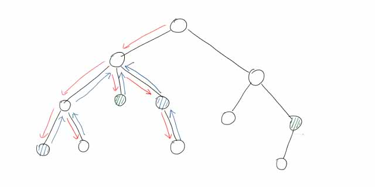

---
### 写在前面
我记这个笔记并不是去上什么课了，单纯是因为翻开书突然发现自己什么都不会（

---
### $O(n\log n)$ 时间复杂度求最长上升子序列
#### 算法思路
贪心思想，每次最有可能更新最长上升子序列长度的一定是更小的数。（感性理解）
#### 算法步骤
设原数组 $a$，新开数组 $d$，长度 $\text{len}=0$。
1. 若 $a_i>d_\text{len}$，$\text{len}\leftarrow\text{len}+1$，$d_\text{len}\leftarrow a_i$，即在 $d$ 末尾追加 $a_i$。
2. 若 $a_i<d_\text{len}$，则找到第一个大于等于 $a_i$ 的 $d_j$，$d_j\leftarrow a_i$。
3. 若 $a_i=d_\text{len}$，不做任何操作，当然把这个归到操作 $2$ 上也没问题。
#### 正确性
操作 $1$、$3$ 相当于找到了LIS的尾。  
操作 $2$ 相当于更新LIS最优路径，$d$ 存储候选元素。这个路径可能走也可能不走，但最后一个数更新就表示走这条路径。  
三个操作保持了LIS的单调性，保持了算法的正确性。
#### 算法实现
每次判断当前元素与 $d$ 末尾元素。如果 $a_i\ge d_\text{len}$，使用 `std::lower_bound()` 二分查找左边界并替换。  
具体实现见代码。
#### 最长不下降子序列
类似，有小变动。

设原数组 $a$，新开数组 $d$，长度 $\text{len}=0$。
1. 若 $a_i\ge d_\text{len}$，$\text{len}\leftarrow\text{len}+1$，$d_\text{len}\leftarrow a_i$，即在 $d$ 末尾追加 $a_i$。
2. 若 $a_i<d_\text{len}$，则找到第一个大于 $a_i$ 的 $d_j$，$d_j\leftarrow a_i$。
#### 代码
##### 方法一
和上面的一样，先判断 $d_\text{len}$ 追加，再替换。

[AC](https://www.luogu.com.cn/record/171049526) 728.00KB 22ms
```cpp
#include <cmath>
#include <cstdio>
#include <cstring>
#include <iostream>
#include <algorithm>
using namespace std;
typedef long long ll;

char buf[1<<20], *p1, *p2;
#define getchar() (p1==p2&&(p2=(p1=buf)+fread(buf,1,1<<20,stdin),p1==p2)?0:*p1++)

inline ll read() {
	ll x=0, f=1; char ch=getchar();
	while (ch<'0'||ch>'9') {if (ch=='-') f=-1; ch=getchar();}
	while (ch>='0'&&ch<='9') x=(x<<1)+(x<<3)+(ch^48), ch=getchar();
	return x*f;
}

#define N 5010
int n, m;
int a[N], d[N];

signed main() {
	// freopen("a.in", "r", stdin);
	n=read();
	if (n==0) return puts("0"), 0;
	for (int i=1; i<=n; ++i) a[i]=read();
	m=1, d[1]=a[1];
	for (int i=2; i<=n; ++i) {
		if (a[i]>d[m]) {d[++m]=a[i]; continue;} // 上升
		// if (a[i]==d[m]) {d[++m]=a[i]; continue;} // 不下降
		*lower_bound(d+1, d+m+1, a[i])=a[i]; // 上升
		// *upper_bound(d+1, d+m+1, a[i])=a[i]; // 不下降
	}
	printf("%d\n", m);
	return 0;
}

```
##### 方法二
来自[OI-Wiki](https://oi-wiki.org/dp/basic/#%E7%AE%97%E6%B3%95%E4%BA%8C)。  
先将所有元素初始化为 $\infty$，这样替换也是追加。

[AC](https://www.luogu.com.cn/record/171049489) 728.00KB 22ms (一模一样)
```cpp
signed main() {
	freopen("a.in", "r", stdin);
	n=read();
	for (int i=1; i<=n; ++i) a[i]=read();
	memset(d, 0x3f, sizeof(d));
	for (int i=1; i<=n; ++i) {
		*lower_bound(d, d+n, a[i])=a[i]; // 上升
		// *upper_bound(d, d+n, a[i])=a[i]; // 不下降
	}
	for (int i=0; ; ++i) if (d[i]==INF) return printf("%d\n", i), 0;
	return 0;
}

```

---
### 模拟退火算法
之前的文章 - [随机化笔记 24-02-04](../Note-24-02-04/)

当前方向 $x$，随机方向 $x_1$，决定是否朝这个方向移动。
- 若更优，即 $f(x\')>f(x)$，则移动；
- 若更劣，即 $f(x\')\le f(x)$，则有概率 $P$ 移动：
$$
P=\exp(\frac{f(x\')-f(x)}{kT})
$$
其中，参数 $k$ 人为确定，温度 $T$ 随时间减小。这意味着，$f(x\')$ 比 $f(x)$ 劣得更多、进行时间越长、参数 $k$ 越小，都会导致越难移动。

---
### 倍增求LCA
#### 预处理
$f_{i,j}$ 表示 $i$ 的 $2^j$ 辈祖先（$\text{dep}$ 低 $2^j$）。

分两步求：先走 $2^{j-1}$ 步，再走 $2^{j-1}$ 步。
$$
f_{i,j}=f_{f_{i,j-1},j-1}
$$
```cpp
// f[i][0]=fa[i]
for (int j=1; j<=k; ++j) for (int i=1; i<=n; ++i) {
	f[i][j]=f[f[i][j-1]][j-1];
}
```
时间复杂度 $O(n\log n)$。
#### 求解
1. 深的与浅的到达同一高度；
2. 两端同时往上跳。
```cpp
// k=logN
int lca(int x, int y) {
	if (dep[x]>dep[y]) swap(x,y);
	for (int i=k; ~i; --i) if (dep[f[y][i]]>=dep[x]) y=f[y][i];
	if (x==y) return x;
	for (int i=k; ~i; --i) if (f[x][i]!=f[y][i]) x=f[x][i], y=f[y][i];
	return f[x][0];
}
```
时间复杂度 $O(\log n)$。

---
### RMQ求LCA
先求欧拉序。令 $l\le r$，查找 $[l,r]$ 中欧拉序编号最小的点，对应节点即为LCA。

预处理时间复杂度 $O(n\log n)$，查询 $O(1)$。

好像有一种动态区间RMQ算法能做到 $O(n)$？

---
### Tarjan算法求LCA
> 说句闲话，Tarjan这次借助自己发明的并查集二次发明了一个新算法。
#### 算法实现
离线算法。

1. 第一次访问更新 $\text{vis}$；
2. 回溯过程更新 $\text{fa}$。

```cpp
int fa[N];
int find(int x) {
	return (x==fa[x])?x:fa[x];
}

int dfs(int u) {
	vis[u]=1;
	for (int i=head[u]; i; i=e[i].nxt) {
		if (!vis[v]) dfs(v), fa[v]=u;
	}
	if (存在询问u↔v&&vis[v]) lca[u↔v]=find(v);
}
```
时间复杂度 $O(n)$。
#### 算法原理
该算法巧妙地利用了回溯的特性。由于回溯从低到高进行，$\text{fa}$ 只会更新到LCA上。

首先，树上有几对关键点，表示待求LCA的点对。图上有两对（蓝和绿），挑蓝的一对讲。  
  

在以LCA为根节点的子树内时，遍历过的节点的 $\text{fa}$ 值都会更新到LCA上。  
如果不进入上一层子树，这些节点的 $\text{fa}$ 值就都在这一个点上了。  
也就是说，$u$ 遍历完成时，$u$ 下方节点的 $\text{fa}$ 都在 $u$ 上。

然后最关键的来了，如果说存在访问 $u\leftrightarrow v$，$v$ 已遍历，说明 $\text{lca}\_{u,v}$ 已遍历，且 $\text{fa}\_u=\text{lca}_{u,v}$。
<!--这里LaTeX又炸了，好多“_”下划线未识别，需要手动加反斜杠“\”-->

$u\rightarrow\text{lca}$ 回溯过程是确定的，因为只有回溯到LCA才能访问 $v$。  
另外，回溯不到LCA上方，意味着 $\text{fa}$ 就更新到了LCA。

你们应该是没有理解的，不过无所谓，用到的概率不大。我以后会专门写一篇的。

---
### ST表
这个也是那天学的，我已经写出[一篇文章](../Sparse-Table/)了。
