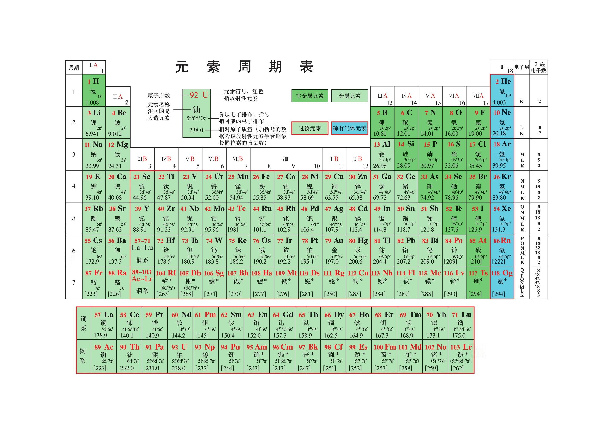

---
### 原版
摘自人教版化学必修一

---
### 注音

| 周期 |           IA            |          IIA           |          IIIB           |          IVB           |          VB           |          VIB          |          VIIB           |          VIII          |                       |                        |           IB            |          IIB           |          IIIA          |          IVA           |           VA            |          VIA          |          VIIA          |           0            |
| :--: | :---------------------: | :--------------------: | :---------------------: | :--------------------: | :-------------------: | :-------------------: | :---------------------: | :--------------------: | --------------------- | ---------------------- | :---------------------: | :--------------------: | :--------------------: | :--------------------: | :---------------------: | :-------------------: | :--------------------: | :--------------------: |
|  1   |  1 H 氢 qīng  |                        |                         |                        |                       |                       |                         |                        |                       |                        |                         |                        |                        |                        |                         |                       |                        | 2 He 氦 hài  |
|  2   |  3 Li 锂 lǐ   |    4 Be 铍 pí     |                         |                        |                       |                       |                         |                        |                       |                        |                         |                        | 5 B 硼 péng  |  6 C 碳 tàn  |  7 N 氮 dàn   | 8 O 氧 yǎng |  9 F 氟 fú   | 10 Ne 氖 nǎi |
|  3   |  11 Na 钠 nà  |  12 Mg 镁 m  |                         |                        |                       |                       |                         |                        |                       |                        |                         |                        | 13 Al 铝 lǚ  | 14 Si 硅 guī |  15 P 磷 lín  | 16 S 硫 liú | 17 Cl 氯 lǜ  | 18 Ar 氩 yà  |
|  4   |  19 K 钾 jiǎ  | 20 Ca 钙 gài | 21 Sc 钪 kàng | 22 Ti 钛 tài | 23 V 钒 fán | 24 Cr 铬 gè | 25 Mn 锰 měng | 26 Fe 铁 tiě | 27 Co 钴 gǔ | 28 Ni 镍 niè | 29 Cu 铜 tóng | 30 Zn 锌 xīn | 31 Ga 镓 jiā | 32 Ge 锗 zhě | 33 As 砷 shēn | 34 Se 硒 xī | 35 Br 溴 xiù | 36 Kr 氪 kè  |
