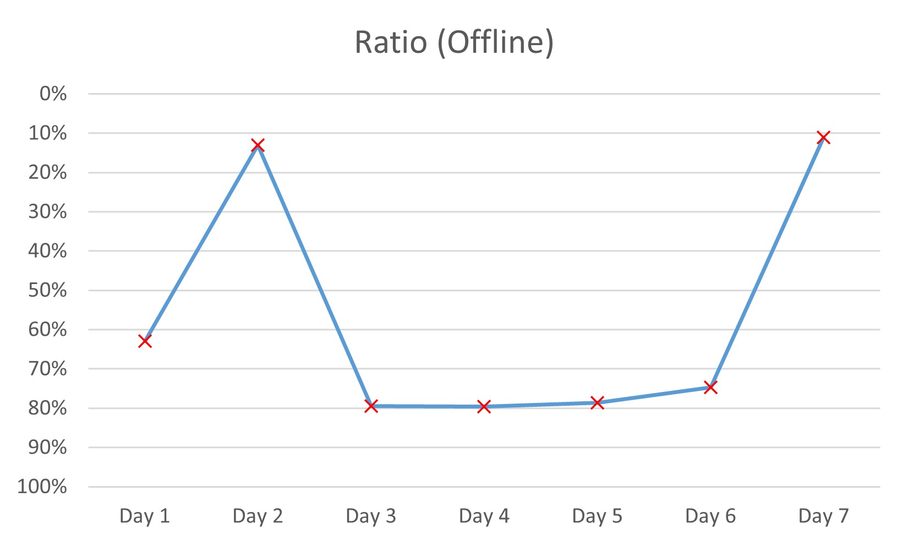

---
### 模拟赛
排名如下。是的，一次都没进前 $10\\%$，几乎次次都在 $50\\%$ 以后。

$$
\begin{array}{c|cc}
\text{日期}&\text{我的排名}&\text{总评测人数}\\\\
\hline\text{Day 1}&56&89\\\\
\text{Day 2}&11&84\\\\
\text{Day 3}&66&83\\\\
\text{Day 4}&70&88\\\\
\text{Day 5}&70&89\\\\
\text{Day 6}&62&83\\\\
\text{Day 7}&9&81
\end{array}
$$

昨天脑残数组开小，今天没想到要判零判重；前天一道题做了三小时连暴力都没写，后天想出了正解却又调不出来。

总结：寄，天天都在破大防。

---
### 听课
#### Day 1 - 数论
上课感觉听得差不多，但是晚上回到宿舍发现都忘了，题也不会做。
#### Day 2 - 可持久化数据结构
本来就一点都不会的东西，听了个半斤八两。思路听懂了，但是实现一点也不会。
#### Day 3 - 数位DP与状压DP
换根DP之前讲过，听得比较顺利。  
但是树形背包例题之前讲过现在一点印象都没有，再听一边还是不会QWQ。  
状压之前没见太多，现在听了感觉很难很神奇。
#### Day 4 - DP优化
抽象。

单调队列和斜率优化会写代码，但是不会推式子。遇到题卡在第一步：连这是DP都看不出来，更别说第二步能凑出基本构型了。  
李超线段树，确实会，但是对我来说相当不好调，~~我也不期望我能在考场上写出来这种东西~~。

CDQ分治会不了一点。决策单调性知道了要打表，但是不知道怎么打表。  
让我最破防的一点是，别人一猜就能猜出来的单调性，我愣是推半天也推不出来。
#### Day 5 - Tarjan与图的连通性问题
终于听懂了。之前在学校里学得比较扎实，在这里对算法原理和各种概念有了更进一步的理解。
#### Day 6 - 字符串
今天是QYC讲，所以你已经完全理解了。

Manacher是一点也听不懂，看上去不简单，打算回头再学。  
dfa前面都听懂了，听到dfa最小化就不会了，后面掉线了。  
kmp由于之前会，所以听得很顺利。这次终于把“跳border”这一块听懂了。
#### Day 7 - 线段树
听上去很简单，实际一点也不难。大抵是听明白了。
#### 其他
模拟赛讲题讲了一些Trick，我听懂了七八分。算是理解了，也记下来了，但是我也不确定以后做题的时候能不能想起来。  
笔记记了若干张纸，现在回看一点也记不起来。

---
### 补题
补个啥题，听也听不懂，做也做不会。

---
### 小插曲
Day 4，我哭了一晚上。我想起了去年的集训，想起了一年来我学的算法做的题，想起了走散的好朋友，想起了这学期同学们对我的嘲笑与不认可。我底子确实不扎实，技不如人，模拟赛挂分也说不上啥。我第一次感到了深深的无助和绝望。

Day 5，模拟赛又垫底了。我中午就想着要退役，站在老师面前把营员证摔给他，再买票坐车会济南。剩下一个月抓紧赶文化课，回到普通班继续普通下去。  
晚上我去找硕硕玩。他和我聊了很多，聊了怎么学算法、怎么积累Trick、怎么平衡文化课和竞赛。  
“你什么时候开始做计划都不晚。只要你想做，你随时都可以做。这个计划可以帮助你清楚地规划你该学什么，但最主要意义是，当你完成这一阶段的目标后，你会有一种成就感，而这种成就感会推着你向前走。”

LTR说，我们这一届只会留下几个，剩下的拿了省一就赶走了。

既然你知道自己进不了省队，马上就会退役，也要继续打，至少拿到省一再退役。不然，这么多年的心血，谁又会甘心呢。

---
### 收获
我最大的收获就是彻底了解了我的实力和位置。我确定以后进不了省队，也看清了自己和退役之间的距离。  
没去听讲座感觉有些遗憾。这么好的机会居然在宿舍里补题，我也不知道当时怎么想的。

---
### 后面的路
学校讲的东西对我来说非常难，我学会了也得不到多少额外的分，这也是我这一年成绩没怎么提升的一部分原因。但是，这些知识确实很有用，至少在我达到更高阶段之后。

CSP-S之前，复习基础算法，**特别是DP**。这是我最薄弱的地方，也是最常考的。然后多做往年真题，Virtual Practice。

NOIP之前，打模拟赛，背模板。

至于我底子薄这个问题，暂时还没想好是继续跟学校学高级算法还是自己复习基础内容。这个等开了学和教练讨论。  
课余时间多学竞赛，文化课先放一放。不过期中考试着实让人头疼，等开学后再说吧。
