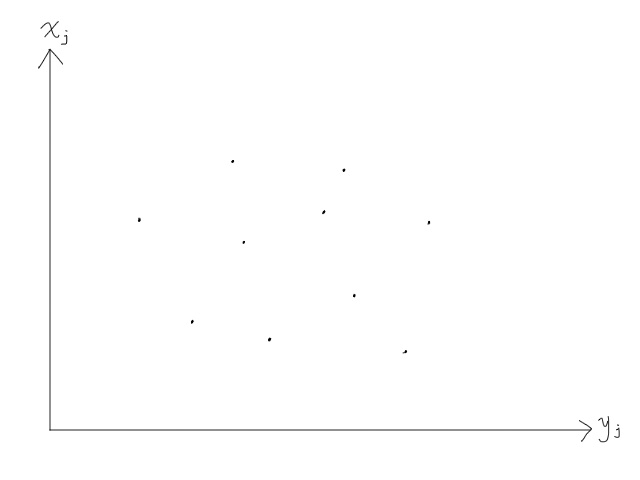
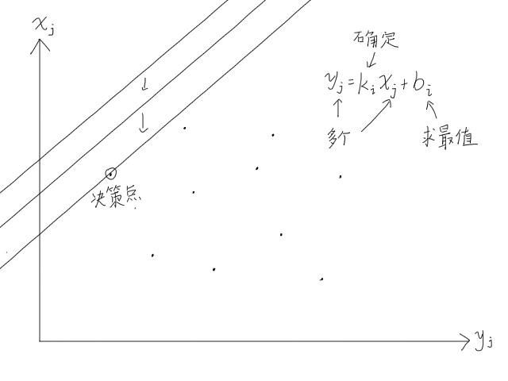
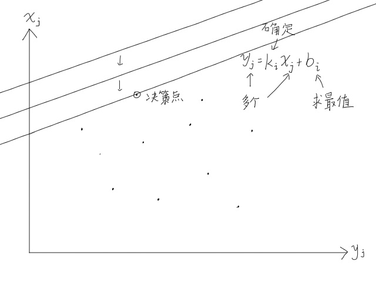
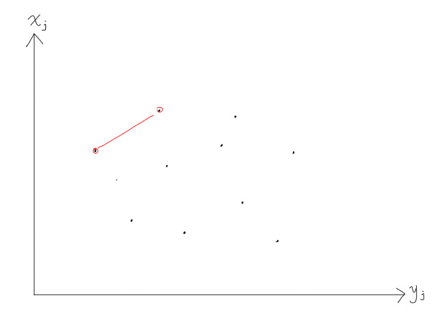
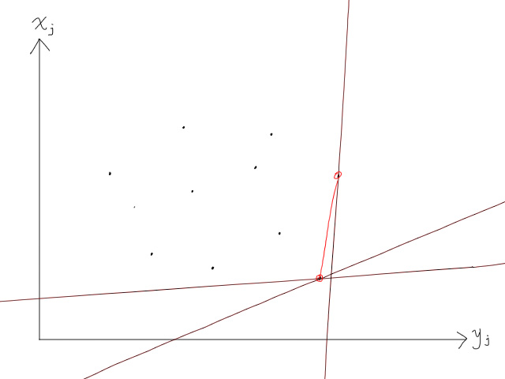
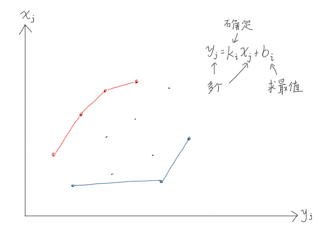
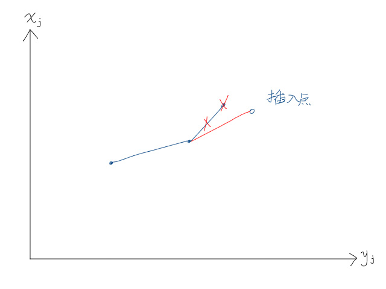

---
### 知识前置
#### 线段树
一个支持维护区间信息的数据结构。  
详见[OI-Wiki](https://oi-wiki.org/ds/seg/)。

---
### 算法定义
斜率优化是一种常用于**动态规划**问题的优化技巧，特别是在处理形如$dp[i] = \min/\max\{a[j]\times b[i] + c[j] + d[i]\}$的状态转移方程时，通过**维护一个凸包或凹包**来快速找到最优的$j$。斜率优化算法通过减少不必要的计算，能够显著提高动态规划的效率。

---
### 使用条件
1.动态规划状态转移方程能转化为$a[j] * b[i] + c[j] + d[i]$形式，且需要维护$d[i]$最值。  
2.外层$i$循环，内层$j$循环。
3.$x[j]$要求严格单调递增。  
4.决策点位置在上凸壳或下凸壳上。

---
### 算法原理
首先，我们将转移方程去掉$\min$和$\max$运算符，只保留内部式子。  
转化为$y[j]=k[i]\times x[j]+b[i]$形式，将每一个$j$所表示的数画在图像上，如图所示。  
  
由于$i$循环在外层，所以$k[i]$确定，需要求最大或最小的$b[i]$。

当需要取的$b[i]$为最大值时，  
  
  
不难发现，不论如何改变斜率，决策点永远是在上面两个点上。  
  
最小值也是一样，不论如何改变斜率，决策点永远是在下面两个点上。  
  
多举几个例子看一下，可以发现，最大决策点永远在上凸包上，最小决策点永远在下凸包上。  
  
所以，对于这类问题，只需要根据操作运算符存储上凸包和下凸包上的点即可。可以使用单调队列维护，保证斜率递增/递减。  
以维护下凸包(即最小值)为例，插入一个点后，如果连接上上个点的斜率比上一个点斜率小，就删去上一个点。  
  

---
### 算法实现
以[P3195 玩具装箱](https://www.luogu.com.cn/problem/P3195)为例，题目要求维护$f[i]$最小值。  
前缀和$s$，$L$提前减一，化式子：  
$f[i]=s[i]^2−2s[i]L+dp[j]+(S[j]+L)^2−2s[i]s[j]$  
按斜率优化思路，$x[j]=s[j],\ y[j]=(f[j]+(s[j]+L)^2$。  
接着单调队列维护即可。

代码：
```cpp
#include <cmath>
#include <ctime>
#include <cstdio>
#include <cstdlib>
#include <cstring>
#include <iostream>
#include <algorithm>
using namespace std;
typedef long long ll;

char buf[1<<20], *p1, *p2;
#define getchar() (p1==p2&&(p2=(p1=buf)+fread(buf,1,1<<20,stdin),p1==p2)?0:*p1++)

inline ll read() {
	ll x=0, f=1;
	char ch=getchar();
	while (ch<'0'||ch>'9') {if (ch=='-') f=-1;ch=getchar();}
	while (ch>='0'&&ch<='9') {x=(x<<3)+(x<<1)+(ch^48);ch=getchar();}
	return x*f;
}

#define N 50010
#define x(a) s[a]
#define y(a) (f[a]+(s[a]+L)*(s[a]+L))
#define k(a) (s[a]<<1)
#define up(a,b) (y(b)-y(a))
#define down(a,b) (x(b)-x(a))
ll n, L;
ll c[N], s[N], f[N];
ll l, r, q[N];

signed main() {
	n=read();
	L=read()+1;
	for (int i=1; i<=n; ++i) c[i]=read(), s[i]=s[i-1]+c[i]+1;
	for (int i=1; i<=n; ++i) {
		while (l<r&&up(q[l],q[l+1])<=down(q[l],q[l+1])*k(i)) ++l;
		f[i]=f[q[l]]+(s[i]-s[q[l]]-L)*(s[i]-s[q[l]]-L);
		while (l<r&&up(q[r-1],q[r])*down(q[r],i)>=up(q[r],i)*down(q[r-1],q[r])) --r;
		q[++r]=i;
	}
	printf("%lld\n", f[n]);
	return 0;
}

```

注意，此处的`up`和`down`函数起到判断斜率的作用。  
