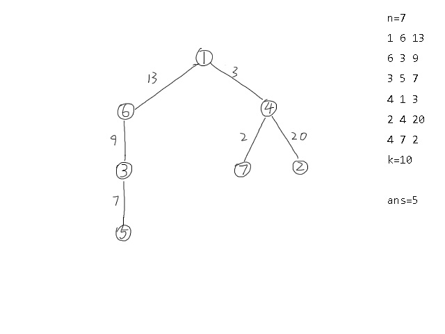
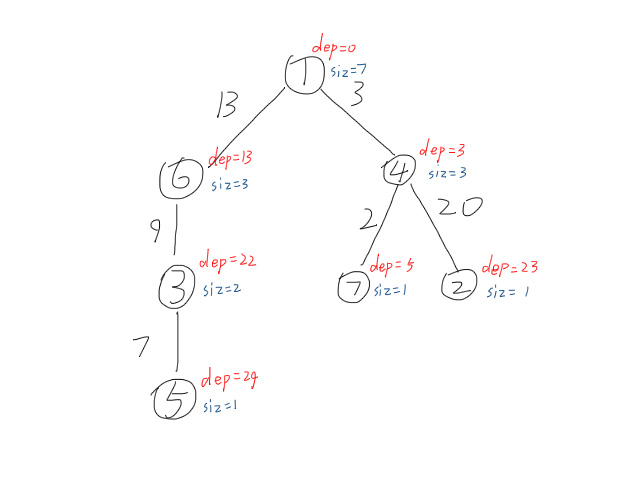
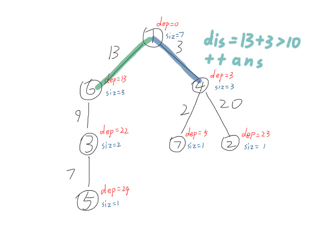
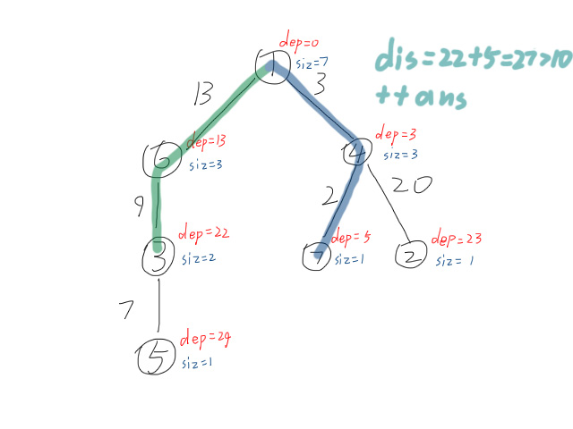
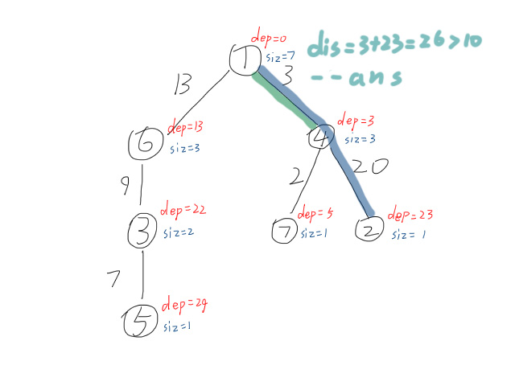
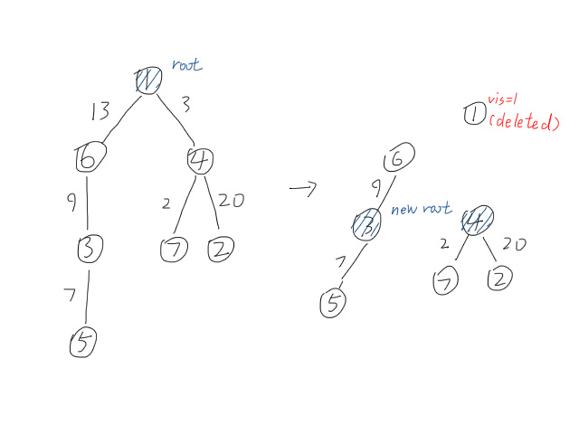

---
### 知识前置
#### 树
无环联通图，有唯一一个前驱。  
详见[OI-Wiki](https://oi-wiki.org/graph/tree-basic/)。
#### 点分治
一个树上暴力优化算法，时间复杂度$O(n\log n)$。  
详见[OI-Wiki](https://oi-wiki.org/graph/tree-divide/#%E7%82%B9%E5%88%86%E6%B2%BB)，或前往[另一篇文章](/2024/03/24/Divide-and-Conquer-on-Trees/)。

---
### 题目描述
更详细的描述，请前往[洛谷](https://www.luogu.com.cn/problem/P4178)查看。

给定一棵$n$个节点的树，每条边有边权$w$，求出树上两点距离小于等于$k$的点对数量。  
样例如图所示：  


数据范围：$1\le n\le4\times10^4$，$0\le w\le1\times10^3$，$0\le k\le1\times10^4$。

---
### 解题思路
#### 暴力算法
对于每两个点都求一遍距离，预处理后统一比较。  
时间复杂度和空间复杂度都是$O(n^2)$，然后爆了。
#### 点分治优化
我们知道，点分治解将树上路径统计相关问题，时间复杂度在$O(n\log n)$以内。

操作步骤：  
一、找到当前子树的重心；  
二、预处理深度和大小信息；  
  
三、匹配深度，判断是否大于$k$，若大于则统计进答案；  
  
  
四、删去同一子树内的答案；  
因为匹配时答案包含同一子树内的路径，但同一子树内的不是简单路径，不合题意，需减去。  
  
五、将树拆分，查找新的重心递归求解。  

#### 双指针优化
注意到匹路径时需要遍历树内所有节点，时间复杂度$O(n^2)$。  
可以使用双指针优化，先对深度排序，再删去不合适的，最终取加和即为答案。  
对照代码自己理解一下。  

---
### 代码
```cpp
#include <cmath>
#include <ctime>
#include <cstdio>
#include <cstdlib>
#include <cstring>
#include <iostream>
#include <algorithm>
using namespace std;
typedef long long ll;

char buf[1<<20], *p1, *p2;
#define getchar() (p1==p2&&(p2=(p1=buf)+fread(buf,1,1<<20,stdin),p1==p2)?0:*p1++)

inline ll read() {
	ll x=0, f=1;
	char ch=getchar();
	while (ch<'0'||ch>'9') {if (ch=='-') f=-1; ch=getchar();}
	while (ch>='0'&&ch<='9') {x=(x<<3)+(x<<1)+(ch^48); ch=getchar();}
	return x*f;
}

#define N 40010
#define v e[i].to
#define w e[i].val
int n, k, t1, t2, t3, ans;
int head[N], tot;
int siz[N], Fa[N], son[N], rt[N], cnt, h[N];
bool vis[N];

struct edge {
	int to, nxt, val;
} e[N<<1];

void add_edge(int x, int y, int z) {
	e[++tot].nxt=head[x], e[tot].to=y, e[tot].val=z, head[x]=tot;
}

void getroot(int u, int fa) {
	siz[u]=1, Fa[u]=fa, son[u]=0;
	for (int i=head[u]; i; i=e[i].nxt) {
		if (v==fa||vis[v]) continue;
		getroot(v, u);
		siz[u]+=siz[v];
		if (siz[son[u]]<siz[v]) son[u]=v;
	}
	if (son[u]==0) {rt[u]=u; return;}
	rt[u]=rt[son[u]];
	while (max(siz[son[rt[u]]], siz[u]-siz[rt[u]])>siz[u]>>1) rt[u]=Fa[rt[u]];
}

void dfs1(int u, int fa, int de) {
	h[++cnt]=h[0]+de;
	for (int i=head[u]; i; i=e[i].nxt) {
		if (v==fa||vis[v]) continue;
		dfs1(v, u, de+w);
	}
}

int calc(int u, int wi) {
	cnt=0, h[0]=wi;
	dfs1(u, 0, 0);
	sort(h+1, h+cnt+1);
	int l=1, r=cnt, res=0;
	while (r>=l) {
		if (h[r]+h[l]<=k) res+=(r-l), ++l;
		else --r;
	}
	return res;
}

void dfs2(int u) {
	getroot(u, 0);
	u=rt[u], vis[u]=1;
	ans+=calc(u, 0);
	for (int i=head[u]; i; i=e[i].nxt) {
		if (vis[v]) continue;
		ans-=calc(v, w);
		dfs2(v);
	}
}

signed main() {
	n=read();
	for (int i=1; i<n; ++i) {
		t1=read(), t2=read(), t3=read();
		add_edge(t1, t2, t3), add_edge(t2, t1, t3); 
	}
	k=read();
	dfs2(1);
	printf("%lld\n", ans);
	return 0;
}

```


