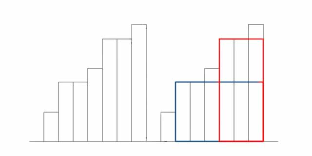
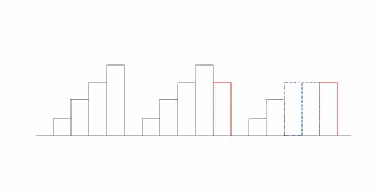
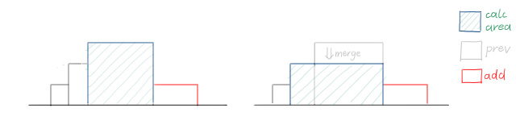

---
### 知识前置
#### 单调栈
从栈底到栈顶递增/递减的栈，可以用于维护比当前数大/小的前一个/后一个值。详见[OI-Wiki](https://oi-wiki.org/ds/monotonous-stack/)。

---
### 题目描述
[SPOJ](https://www.spoj.com/problems/HISTOGRA/) | [洛谷SP1805](https://www.luogu.com.cn/problem/SP1805) HISTOGRA - Largest Rectangle in a Histogram  
  
如图所示，在一条水平线上有 $n$ 个宽为 $1$ 的矩形，其高度分别为 $a_1,\ a_2,\ \dots,\ a_n$。求包含于这些矩形的最大子矩形面积。

数据范围：$n\le1\times10^5$。

没错，这是一道绿题(普及+/提高)，本蒟蒻这个阶段了还会被绿题卡住QWQ。

---
### 解法一 - 单调栈
#### 考虑递增序列
如图所示，最后的决策点只可能位于角落位置。  
  
如果矩形按递增顺序排列，只需要对每个矩形向右合并即可。  
具体地，对于第 $i$ 个矩形，它的右边还有 $n-i$ 个高度大于等于它的矩形。加上自己，可合并的矩形数为 $n-i+1$。  
最大从自身高度开始合并，因此 $\text{ans}\leftarrow\min(\text{ans},a_i\times(n-i+1))$，可以 $O(1)$ 求解。
#### 维护递增序列
注意看，在加入一个不满足单调递增的矩形后，按照单调栈的规则，我们需要将前方不满足单调性的矩形(即高度大于等于当前高度的矩形)弹出，使得新加入的矩形满足单调性。  
  
但是，弹出的矩形可能会影响答案统计。如图所示，本应该被统计的三格宽度被剪成了一个。所以我们需要保留为等高度的，图上虚线表示。
#### 答案统计
回顾向右合并的过程。显然我们无法在全部操作后再向右合并，那样会造成答案丢失。

考虑什么时候一个矩形对答案没有贡献。正是它被弹出，左边和右边的都比他矮，他下一秒就被压成和右边一样高的时候。  
此时，答案需要被这一块更新，然后这一块会加入下一个更低的块进行更新。

具体是这样的：  
  
弹出时需要统计答案，同时向上一个块合并。
#### 最终做法
维护一个从栈底到栈顶单调递增的栈，将矩阵高度从左向右压入。  
相邻相同高度的使用`wid[N]`数组存储宽度，表示一块，统计时答案为 $h_i\times wid_i$。  
弹栈，把栈顶丢掉的同时将栈顶这一块合并到新栈顶的一块上。  
时间复杂度 $O(n)$。

代码实现略有不同，但整体思路一致。`width`变量存储当前栈顶那一块的宽度。
#### 代码
[AC](https://www.luogu.com.cn/record/170785663) 5.20MB 20ms
```cpp
#include <cmath>
#include <cstdio>
#include <cstring>
#include <iostream>
using namespace std;
typedef long long ll;

char buf[1<<20], *p1, *p2;
#define getchar() (p1==p2&&(p2=(p1=buf)+fread(buf,1,1<<20,stdin),p1==p2)?0:*p1++)

inline ll read() {
	ll x=0, f=1; char ch=getchar();
	while (ch<'0'||ch>'9') {if (ch=='-') f=-1; ch=getchar();}
	while (ch>='0'&&ch<='9') x=(x<<1)+(x<<3)+(ch^48), ch=getchar();
	return x*f;
}

#define N 100010
int n; ll ans;
int a[N], wid[N];
int stk[N], top;

signed main() {
	// freopen("a.in", "r", stdin);
	while (true) {
		n=read(), top=ans=0;
		if (!n) break;
		for (int i=1; i<=n; ++i) a[i]=read();
		a[++n]=0;
		for (int i=1; i<=n; ++i) {
			int width=0;
			while (top&&a[stk[top]]>=a[i]) {
				width+=wid[top];
				ans=max(ans, 1LL*width*a[stk[top]]);
				--top;
			}
			stk[++top]=i;
			wid[top]=width+1;
		}
		printf("%lld\n", ans);
	}
	return 0;
}

```
#### 总结
会 $O(n^2)$ 暴力、发现可以使用单调栈统一处理可行答案，是解决本题的关键。

借助单调性处理问题的思想在于**及时排除不可能的选项，保持策略集合的高度有效性和秩序性**，从而为我们做出决策提供更多的条件和可能的方法。（摘自李煜东《算法竞赛进阶指南》）

---
### 解法二 - 悬线法
这个算法真的很有意思，建议[一览](https://oi-wiki.org/misc/hoverline/#%E4%BE%8B%E9%A2%98)。

由于适用范围较小且有单调栈的通解，暂且不讲。
