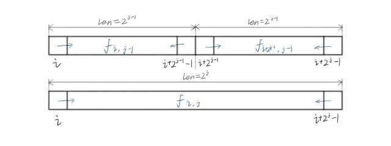
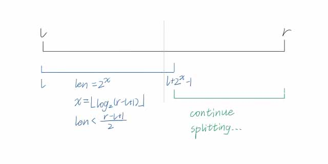
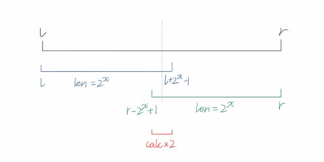

---
### 解决问题
适用于预处理后离线查询一类问题。

给定 $n$ 个数 $a_i$ 和 $m$ 个区间 $[l_i,r_i]$，询问每个区间内 $\operatorname{opt}$ 的值。  
$O(n\log n)$ 预处理，$O(1)$ 查询。

---
### 应用条件
1. 满足结合律，即 $\operatorname{opt}(x,y,z)=\operatorname{opt}(\operatorname{opt}(x,y),z)=\operatorname{opt}(x,\operatorname{opt}(y,z))$。
2. 满足“可重复贡献”，即 $\operatorname{opt}(x,x)=x$。

---
### 算法原理
#### 倍增预处理
设 $f_{i,j}$ 表示从 $i$ 开始、长度为 $2^j$ 的区间 $[i,i+2^i-1]$ 的 $\operatorname{opt}$ 值，即：
$$
f_{i,j}=\mathop{\operatorname{opt}}_{x=i}^{i+2^j-1}a_x
$$

有递推式：
$$
f_{i,j}=\operatorname{opt}(f_{i,j-1},f_{i+2^{j-1},j-1})
$$

证明如下：
$$
\begin{aligned}
f_{i,j}=&\mathop{\operatorname{opt}}\_{x=i}^{i+2^j-1}a_x\\\\
=&\operatorname{opt}(\ \mathop{\operatorname{opt}}\_{x=i}^{i+2^{j-1}-1}a_x,\ \mathop{\operatorname{opt}}\_{x=i+2^{j-1}}^{i+2^j-1}a_x\ )\\\\
=&\operatorname{opt}(\ \mathop{\operatorname{opt}}\_{x=i}^{i+2^{j-1}-1}a_x,\ \mathop{\operatorname{opt}}\_{x=i+2^{j-1}-1+1}^{i+2^{j-1}-1+1+2^{j-1}-1}a_x\ )\\\\
=&\operatorname{opt}(\ f_{i,\ j-1},\ f_{i+2^{j-1},\ j-1}\ )
\end{aligned}
$$
<!--这里我也不知道咋回事，得用“\_”代替“_”，可能是编译出了点小问题。-->
如图：  
  
这样，每一个长度为 $2^j$ 的区间都能由两个长度为 $2^{j-1}$ 的区间拼起来。

$i\in[1,n]$，$j\in[1,\log n]$，时间复杂度 $O(n\log n)$。
#### 一般查询
考虑如何将区间 $[l,r]$ 拆分为若干长度为 $2^k$ 的区间。
$$
\mathop{\operatorname{opt}}\_{x=l}^ra_x=\begin{cases}
a_l&l=r\\\\
\operatorname{opt}(\ f_{l,\ \lfloor\log_2(r-l+1)\rfloor},\ \mathop{\operatorname{opt}}\limits_{x=l+2^{\lfloor\log_2(r-l+1)\rfloor}}^r\ )&\text{otherwise.}
\end{cases}
$$
式子很复杂，但意思就是，从区间内找出一个极大的、长度为 $2^k$ 的子区间，使其左端点为 $l$。这样区间就被分为了两部分。子区间使用 $f_{i,j}$ 求解，剩余部分继续拆分，递归求解。

如图所示：  
  
由于每一次都会拆分成 $2^x$ 和 $\text{len}-2^x$ 两个区间，且 $2^x>\frac{\text{len}}2$，所以最多会拆成 $\log n$ 个长度为 $2^x$ 的块。时间复杂度 $O(\log n)$。
#### 考虑重复贡献
注意到剩下的部分也可以被 $2^k$ 子区间覆盖。  
考虑 $\operatorname{opt}$ 运算可以重复贡献，这就意味着中间重复覆盖的部分无需考虑。
$$
\mathop{\operatorname{opt}}\_{x=l}^r=\operatorname{opt}(\ f_{l,\ \lfloor\log_2(r-l+1)\rfloor},\ f_{r-\lfloor\log_2(r-l+1)\rfloor+1,\ r}\ )
$$
如图所示：  
  
只需要一次计算、使用两个 $f_{i,j}$ 即可。时间复杂度 $O(1)$。

---
### $\log_2x$ 倍增预处理
`std::log()`及`std::log2()`能用，但是大量重复使用会导致运行时间过长。  
在只需要求 $\lfloor\log_2x\rfloor$ 的情况，忽略小数部分的情况下，可以提前预处理出 $[1,N]$ 之间的值。

令 $\operatorname{Log}x$ 表示 $\lfloor\log_2x\rfloor$，则有：
$$
\operatorname{Log}x=\begin{cases}
0&x=1\\\\
\operatorname{Log}\lfloor\frac x2\rfloor&\text{otherwise.}
\end{cases}
$$
具体实现见下方代码`main()`函数第二行。

---
### 例题
[洛谷P3865](https://www.luogu.com.cn/problem/P3865) RMQ 问题
#### 题目描述
给出 $n$ 个数 $a_i$ 及 $m$ 个区间 $[l_i,r_i]$，求这些区间内数字的最大值。
#### 解题思路
由于 $\max(a,b)$ 满足结合律 $\max(a,b,c)=\max(a,\max(b,c))$ 和“可重复贡献” $max(a,a)=a$，考虑使用ST表求解。
#### 代码
[AC](https://www.luogu.com.cn/record/165746467) 9.48MB 1.32s
```cpp
#include <cmath>
#include <cstdio>
#include <cstring>
#include <iostream>
using namespace std;
typedef long long ll;

char buf[1<<20], *p1, *p2;
#define getchar() (p1==p2&&(p2=(p1=buf)+fread(buf,1,1<<20,stdin),p1==p2)?0:*p1++)

inline ll read() {
	ll x=0, f=1; char ch=getchar();
	while (ch<'0'||ch>'9') {if (ch=='-') f=-1; ch=getchar();}
	while (ch>='0'&&ch<='9') x=(x<<1)+(x<<3)+(ch^48), ch=getchar();
	return x*f;
}

#define N 100010
int n, m, l, r, x;
int a[N], f[N][20]; // 17
int Log[N];

signed main() {
	// freopen("a.in", "r", stdin);
	for (int i=2; i<N; ++i) Log[i]=Log[i>>1]+1;
	n=read(), m=read();
	for (int i=1; i<=n; ++i) f[i][0]=read();
	for (int j=1; j<=Log[n]; ++j) for (int i=1; i<=n-(1<<j)+1; ++i) {
		f[i][j]=max(f[i][j-1], f[i+(1<<(j-1))][j-1]);
	}
	while (m--) {
		l=read(), r=read(), x=Log[r-l+1];
		printf("%d\n", max(f[l][x], f[r-(1<<x)+1][x]));
	}
	return 0;
}

```
