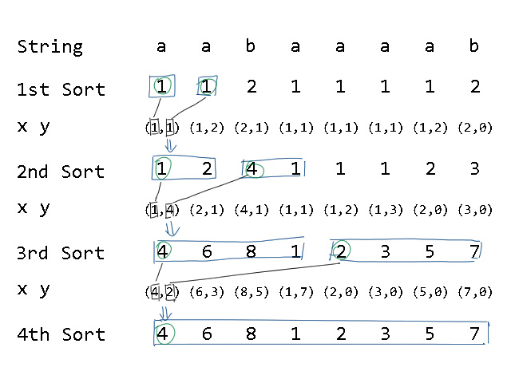

---
### 知识前置
#### 字符串
你需要知道[字符串](https://baike.baidu.com/item/%E5%AD%97%E7%AC%A6%E4%B8%B2/1017763)是什么东西。
#### 基数排序
将待排序元素拆分成$k$个关键字，对关键字排序后即可完成对元素的排序。  
详见[OI-Wiki](https://oi-wiki.org/basic/radix-sort/)

---
### 算法定义
后缀排序是指一个字符串的所有后缀按照字典序排序的结果。  
这个过程涉及到两个数组，$sa$和$rk$，其中$sa[i]$表示字符串的所有后缀按照字典序升序排序后的编号，$rk[i]$表示第$i$个后缀的字典序排名。其中，$sa$称为后缀数组。  
显然，$sa[rk[i]]=rk[sa[i]]=i$，因为第$i$个后缀的排名对应的后缀和第$i$个排名的后缀对应的排名一样，都等于原数组编号。

后缀数组有很多用处，可以解决查找形如$AA$的子串、最小化字典序等问题。

---
### 使用条件
倍增法时间复杂度$O(n\log n)$，空间复杂度$O(n)$。

---
### 算法原理
以串 `aabaaaab`为例：  
| $i$ |         后缀 |
| :---: | -----------: |
| $1$ | `aabaaaab` |
| $2$ |  `abaaaab` |
| $3$ |   `baaaab` |
| $4$ |    `aaaab` |
| $5$ |     `aaab` |
| $6$ |      `aab` |
| $7$ |       `ab` |
| $8$ |        `b` |

后缀排序后：  
| $i$ | 后缀         | $rk[i]$ |
| :---: | ------------ | :-------: |
| $4$ | `aaaab`    |   $1$   |
| $5$ | `aaab`     |   $2$   |
| $6$ | `aab`      |   $3$   |
| $1$ | `aabaaaab` |   $4$   |
| $7$ | `ab`       |   $5$   |
| $2$ | `abaaab`   |   $6$   |
| $8$ | `b`        |   $7$   |
| $3$ | `baaaaab`  |   $8$   |

对后缀完成字典序排序，统计后缀的排名。

---
### 算法实现
#### $O(n^2\log n)$算法
很容易想到，对所有后缀进行 `sort()`排序。  
但这样所需时空复杂度巨大，无法支持大数据量。
#### $O(n\log^2n)$算法
思路是对每个长度为$2^k$的子串排序，求出$rk$值，这样当$2^k>n$时，每个子串就相当于所有后缀。  
每一次排序都利用上一次排序的$rk$值，那么长度为$2^k$的字符串就可以用两个长度为$e^{k-1}$的字符串的排名作为关键字表示，利用 `sort()`进行排序。  
这个的正确性容易证明，因为在将两个长度为$2^{k-1}$的字符串拼接时，比较字典序会先看前面的串，后看后面的串。按第一、第二关键字排序恰好符合。

以 `aabaaaab`为例，倍增过程如下：  
  
这样需要倍增$\log n$次，加上排序$O(n\log n)$。
#### $O(n\log n)$算法
还是倍增的思路，注意到排序有两个关键字，均为排名，值域$1\sim n$，可以使用基数排序。  
倍增$O(\log n)$，排序$O(n)$，总时间复杂度$O(n\log n)$。
#### 基于$O(n\log n)$算法的常数优化
把$rk[id[i]]$存下来，并尝试减少不连续的内存访问，减少内存调度时间。

---
### 代码实现
例题 [洛谷P3809](https://www.luogu.com.cn/problem/P3809) 后缀排序模板
```cpp
#include <cmath>
#include <ctime>
#include <cstdio>
#include <cstdlib>
#include <cstring>
#include <iostream>
#include <algorithm>
using namespace std;
typedef long long ll;

#define N 1000010
int n, m;
int rk[N], y[N], c[N], sa[N];
char s[N];

signed main() {
	scanf("%s", s+1), n=strlen(s+1), m=127;
	for (int i=1; i<=n; ++i) rk[i]=s[i], ++c[rk[i]];
	for (int i=2; i<=m; ++i) c[i]+=c[i-1];
	for (int i=n; i>=1; i--) sa[c[rk[i]]--]=i;
	for (int k=1, d=0; k<=n&&d!=n; k<<=1, m=d, d=0) {
		memset(c, 0, sizeof(c));
		for (int i=n-k+1; i<=n; ++i) y[++d]=i;
		for (int i=1; i<=n; ++i) if (sa[i]>k) y[++d]=sa[i]-k;
		for (int i=1; i<=n; ++i) ++c[rk[i]];
		for (int i=2; i<=m; ++i) c[i]+=c[i-1];
		for (int i=n; i>=1; --i) sa[c[rk[y[i]]]--]=y[i], y[i]=0;
		swap(rk, y), d=1, rk[sa[1]]=1;
		for (int i=2; i<=n; ++i) {
			if (y[sa[i]]!=y[sa[i-1]]||y[sa[i]+k]!=y[sa[i-1]+k]) ++d;
			rk[sa[i]]=d;
		}
	}
	for (int i=1; i<=n; ++i) printf("%d ", sa[i]);
	return 0;
}

```

---
### 最长公共前缀
定义$height[i]$为相邻两排名后缀的最长公共前缀，即$height[i]=LCP(suffix(sa[i]),\ suffix)$。则对于任意满足$rk[j]<rk[k]$的两后缀$j,\ k$，均有

$$LCP(suffix(j),\ suffix(k))=\min^{rk[k]}_{i=rk[j]}\{height[i]\}$$

这个很好证，因为后缀排序是按照字典序的，所以前缀具有传递性。两后缀的最长公共前缀就是中间相邻的最长公共前缀的最小值。  
由此，只要求出$height$数组就能求任意前缀的$LCP$。
#### $O(n^2)$算法
求$height$数组可以从$1$到$n$比较相邻排名的后缀，单次比较$O(n)$，总时间复杂度$O(n^2)$。
#### $O(n)$算法
$height$数组满足性质$height[rk[i]]\ge height[rk[i-1]]-1$，具体证明过程~我也没理解~。  
借助这个性质，匹配相邻排名$LCP$时就可以直接借助上一个的$height$从中间开始，不需要从头比较。比较次数常数级别，会快很多，时间复杂度近似$O(n)$。
#### 代码实现
```cpp
int rk[N], sa[N], height[N]; // rk和sa已求得
char s[N]; // 初始字符串
void calheight() {
	for (int i=0, k=0; i<=n; ++i) {
		if (!rk[i]) continue;
		if (k) --k;
		while (s[i+k]==s[sa[rk[i]-1]+k]) ++k;
		height[rk[i]]=k;
	}
}
```

---
### 写在最后
建议你看一下[这篇论文](https://wenku.baidu.com/view/5b886b1ea76e58fafab00374.html)，讲得比较详细，也有很标准的代码。
