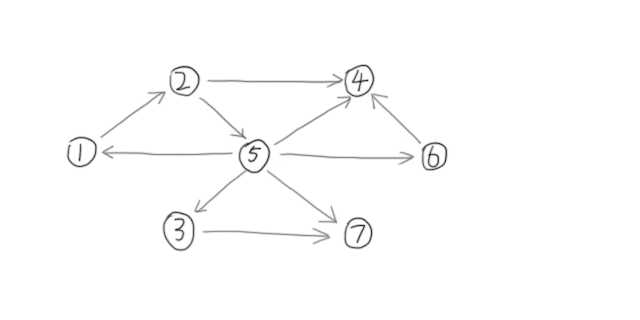

---
### 知识前置
#### 罗伯特·塔扬
图灵奖得主，追求坚持和创新。  
发明了许多算法，持续在数学和计算机领域发光发热。

并查集、Toptree、Splay等算法都是他发明的。
#### DFS序
在对树进行深度优先搜索遍历时，对于每个节点，在刚进入递归后记录一次该点的编号，得到的最后产生的长度为 $N$ 的节点序列。  
设点 $u$ 入栈时时间为 $dfs_u=l_u$，出栈时时间为 $r_u$，若 $v\in T_u$，则 $dfn_v\in[l_u,r_u]$。详见[OI-Wiki](https://oi-wiki.org/graph/dfs/#dfs-%E5%BA%8F%E5%88%97)。
#### DFS搜索树
如图所示，在一个有向图上跑DFS所生成的树。  
DFS搜索树的所有边都由原图中的边组成。

有以下几条边：  
1.树边：表示DFS搜索顺序；  
2.横叉边(斜向边)：兄弟节点之间的边；  
3.前向边：由祖先指向儿子的边(不包含父亲)；  
4.返祖边(后向边)：由子节点指向父亲或祖先的边。  
对于后三种边，要求指向的节点已被访问。一般意义上，“搜索树上的边”仅指树边。

如图所示：  
  

#### 强连通分量
本文所述的**强连通**是对于有向图而言的。

若有向图 $G=(V,E)$ 强连通，则说明对于 $\forall u,v\in V$，总存在路径 $u\rightsquigarrow v$，使得 $u$、$v$ 两点联通。强连通分量指极大的强联通子图。
#### 栈
先进后出的数据结构，详见[OI-Wiki](https://oi-wiki.org/ds/stack/)。

---
### 写在前面
约定：$T_u$ 表示以 $u$ 为根的子树，且包含 $u$；一个点的祖先不包括其父节点。

注意：DFS序 $\neq$ DFN。  
DFN是一个时间戳，是一棵树在DFS过程中访问的相应次序。  
DFS序记录了树上每个点进出的时间戳。

---
### DFS生成树与强连通分量的关系
如果节点 $u$ 是DFS过程中遇到的第一个强连通分量中的点，则强连通分量中剩余的节点一定在 $T_u$ 中。我们称 $u$ 为强连通分量的根。

---
### Tarjan算法求强连通分量
#### 信息
点集 $S$ 表示 $T_u$ 中的节点及从 $T_u$ 通过一条不在搜索树上的边能到达的节点。

$dfn_u$：点 $u$ 第一次被遍历的时间。  
$low_u$：在 $T_u$ 中能够回溯到最早的已经在栈中的节点的 $dfn$，且 $low_u=\min\limits_{v\in S}dfn_v$。至于为什么这两个是一个意思，后面会解释到。  
$scc_u$：答案统计，表示 $u$ 在哪个强连通分量中。
#### 性质
从根节点开始的一条路径中，$dfn$ 严格递增，$low$ 严格非降。即，$dfn_{fa}<dfn_u$，$low_{fa}\le low_u$。  
$dfn$ 递增性质可由定义得知。由于子节点的 $low$ 会被父节点取一次 $\min$，所以父节点的 $low$ 会大于或等于子节点的，$low$ 数组满足非降性质。
#### 维护
从根节点开始DFS，让搜索到的点入栈。每找到一个强连通分量就让强连通分量中的点出栈。  
正确性：由于强连通分量是**极大的联通子图**，所以不会出现一个强连通分量包含另一个的情况。另外，使用栈维护，**先进后出**，可以确保当前强连通分量仅处于栈顶及附近位置，弹出时不会干扰到上层强连通分量的检索和记录。

假设当前搜索到了点 $u$ ，先将点 $u$ 入栈。设 $u$ 可通过边 $e=u\rightarrow v$ 到达点 $v$，则：  
1.若 $v$ 未被访问，说明 $e$ 是搜索树上的边，$v\in T_u$。根据定义，$low_u=\min\{low_u,low_v\}$。此时需继续对 $v$ 进行DFS。  
2.若 $v$ 已被访问且在栈中，说明 $v\notin T_u$，$e$ 也不在搜索树中。根据定义，$low_u=\min\{low_u,dfn_v\}$。此时不可继续对 $v$ 进行DFS，否则会死循环，且不满足 $low$ 的定义，答案正确性无法保证。  
3.若 $v$ 已被访问且未在栈中，说明 $v$ 已搜索完毕，且所在强连通分量已被处理，无需进行任何操作。
#### 答案处理
根据 $low$ 的定义，当且仅当节点 $u$ 为强连通分量的根时，$dfn_u=low_u$。  
因为在强连通分量中，所有点都可到达根 $u$。这些点的 $low$ 值只可能大于或等于 $u$。  
另外，强连通分量的剩余节点都在 $T_u$ 且都已搜索入栈，所以栈中 $u$ 之上的都是强连通分量中的点，而在 $u$ 之下的都不是。

统计答案只需弹栈，弹完 $u$ 为止，弹栈前 $cnt$ 需要加一，表示新的强连通分量。设 $x$ 为栈顶元素，只需将 $scc_x$ 设为标记 $cnt$ 即可。
#### 关于 $low$ 的问题解答
Q: 为什么 $low$ 也是在 $T_u$ 中能够回溯到最早的已经在栈中的节点的 $dfn$？  
A: 分析上述维护过程，前两种情况中的 $v$ 都在栈中。(情况1在对 $v$ DFS之后 $v$ 就进了栈。)

Q: 为什么需要一个 $low$ 辅助算法完成？为什么这样设计 $low$？  
A: 通过 $low$ 的特殊性质，可以保证算法实现简便，同时有正确的答案和相当优秀的时间复杂度。至于如何想出来的，只能说是Tarjan的神力。

---
### 代码实现
[洛谷B3609](https://www.luogu.com.cn/problem/B3609) 强连通分量
#### 题目描述
给定一张 $n$ 个点 $m$ 条边的有向图，求出其所有的强连通分量。
#### 代码
[AC](https://www.luogu.com.cn/record/163839824) 2.36MB 8ms
```cpp
#include <cmath>
#include <cstdio>
#include <cstring>
#include <iostream>
using namespace std;
typedef long long ll;

char buf[1<<20], *p1, *p2;
#define getchar() (p1==p2&&(p2=(p1=buf)+fread(buf,1,1<<20,stdin),p1==p2)?0:*p1++)

inline ll read() {
	ll x=0, f=1; char ch=getchar();
	while (ch<'0'||ch>'9') {if (ch=='-') f=-1; ch=getchar();}
	while (ch>='0'&&ch<='9') x=(x<<1)+(x<<3)+(ch^48), ch=getchar();
	return x*f;
}

#define N 10005
#define M 100005
int n, m, t1, t2;
int dfn[N], tim, low[N];
int stk[N], top; bool instk[N];
int scc[N], cnt, siz[N];

int vis[N];

#define v e[i].to
int head[N], tot;
struct edge {int to, nxt;} e[M<<1];
void add_edge(int x, int y) {e[++tot]={y, head[x]}, head[x]=tot;}

void tarjan(int u) {
	dfn[u]=low[u]=++tim, stk[++top]=u, instk[u]=1;
	for (int i=head[u]; i; i=e[i].nxt) {
		if (!dfn[v]) tarjan(v), low[u]=min(low[u], low[v]);
		else if (instk[v]) low[u]=min(low[u], dfn[v]);
	}
	if (dfn[u]==low[u]) {
		++cnt;
		while (stk[top+1]!=u) scc[stk[top]]=cnt, instk[stk[top--]]=0, ++siz[cnt];
	}
}

signed main() {
	n=read(), m=read();
	for (int i=1; i<=m; ++i) t1=read(), t2=read(), add_edge(t1, t2);
	for (int i=1; i<=n; ++i) if (!dfn[i]) tarjan(i);
	printf("%d\n", cnt);
	for (int i=1; i<=n; ++i) {
		if (vis[i]) continue; int x=scc[i];
		for (int j=1; j<=n; ++j) if (scc[j]==x) printf("%d ", j), vis[j]=1;
		puts("");
	}
	return 0;
}

```

---
### 注意事项
无特殊说明，图均可能不连通，且均可能有重边或自环，所以**特判**千万不能忘！  
一般关于scc的题目，都需要循环 $1\sim n$ DFS，以寻找全部的强连通分量。

---
### 总结
Tarjan算法求强连通分量关键在于 $low$ 的理解与运用。Tarjan算法还有许多变形，需要根据情况调整代码解决问题。
