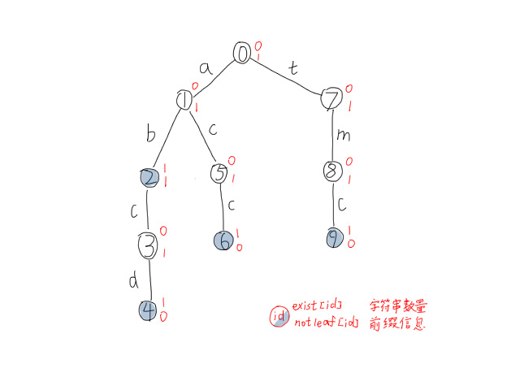

---
### 知识前置
#### AC自动机
一种字符串算法，详见[OI-Wiki](https://oi-wiki.org/string/ac-automaton/)。

---
### 算法定义
字典树，又称前缀树，常用于一组字符串中查找指定的字符串。  
常解决字符串前缀问题，查询一个字符串是否是另一个字符串的前缀。

字符串由结点在树中的位置决定，一个结点的所有子孙拥有相同的前缀，即该结点对应的字符串。  
特别地，根节点表示空字符串。

时间复杂度，$O(N_{sum})$建树，$O(1)$查询；空间复杂度$O(N_{max}\times K)$。  
其中$N_{sum}$表示字符串总长度，$N_{max}$表示最长字符串长度，$K$表示字符种类数量。

---
### 使用条件
对空间要求宽，字符种类较少。

---
### 算法原理
一棵树，从根节点到每一个被标记节点的路径上的所有点都代表一个字符串。

举个例子，这四个字符串`ab` `abcd` `acc` `tmc`在Trie树上可以表示为：  
  

---
### 算法实现
插入一个新的字符串，分为三部分：  
1.顺着树往下找存在的；  
2.直到不存在，新开点，新建边；  
3.加到字符串末尾，打标记。

两个数组，`trie[][]`和`exist[]`。  
`t=trie[i][j]`表示字典树上的边$i\rightarrow t$，权值为$j$，即第$i$个结点连接$k$字符的下一个结点为$t$。  
`exist[i]`表示以`i`结点为末尾的字符串个数，统计存在性、不计数时可用`bool`类型。 

结合代码理解一下：
```cpp
#define N 100010 // 最长字符串长度
#define K 30 // 字符种类
int trie[N][K], exist[N], tot;

void insert(char* s) { // 往trie中添加s字符串
	int len=strlen(s+1), p=0; // s的下标从1开始
	for (int i=1; i<=len; ++i) {
		if (!trie[p][s[i]]) trie[p][s[i]]=++tot; // 新开一点
		p=trie[p][s[i]];
	}
	++exist[p];
}

```

判断一个字符串是否为另一个字符串的前缀，只需要判断每一个被标记的结点是否为叶子结点即可。  
如果这个字符串是另一个字符串的前缀，则末尾节点不为叶子结点，后面还有边。  
考虑新开一个数组存储叶子结点信息，`notleaf[i]=0`表示是叶子结点。  
前缀问题结合下面例题理解一下。

---
### 例题
#### 题目大意
题目传送门：[UVA](https://onlinejudge.org/index.php?option=com_onlinejudge&Itemid=8&category=25&page=show_problem&problem=2347) [PDF](https://onlinejudge.org/external/113/p11362.pdf) [洛谷](https://www.luogu.com.cn/problem/UVA11362)  
多组测试，对于每组数据，给$n$个字符串，判断其中是否存在一个字符串为另一个字符串前缀的情况。有则输出"NO"，无则输出"YES"。
#### AC代码
```cpp
#include <cmath>
#include <ctime>
#include <cstdio>
#include <cstdlib>
#include <cstring>
#include <iostream>
#include <algorithm>
using namespace std;
typedef long long ll;

char buf[1<<20], *p1, *p2;
#define getchar() (p1==p2&&(p2=(p1=buf)+fread(buf,1,1<<20,stdin),p1==p2)?0:*p1++)

inline ll read() {
	ll x=0, f=1;
	char ch=getchar();
	while (ch<'0'||ch>'9') {if (ch=='-') f=-1;ch=getchar();}
	while (ch>='0'&&ch<='9') {x=(x<<3)+(x<<1)+(ch^48);ch=getchar();}
	return x*f;
}

#define N 100010
#define K 15
int T, n, len, tot;
int trie[N][K], exist[N];
char s[N], ch;
bool notleaf[N], flag;

void insert() {
	int p=0;
	for (int i=1; i<=len; ++i) {
		if (!trie[p][s[i]]) notleaf[p]=1, trie[p][s[i]]=++tot;
		p=trie[p][s[i]];
	}
	++exist[p];
}

signed main() {
	T=read();
	while (T--) {
		memset(trie, 0, sizeof(trie));
		memset(exist, 0, sizeof(exist));
		memset(notleaf, 0, sizeof(notleaf));
		tot=0, flag=0, n=read();
		for (int i=1; i<=n; ++i) {
			ch=getchar(), len=0;
			while (ch!='\n') s[++len]=ch-'0', ch=getchar();
			insert();
		}
		for (int i=1; i<=tot; ++i) {
			if (exist[i]&&notleaf[i]) {flag=1; break;}
		}
		puts((flag)?"NO":"YES");
	}
	return 0;
}

```