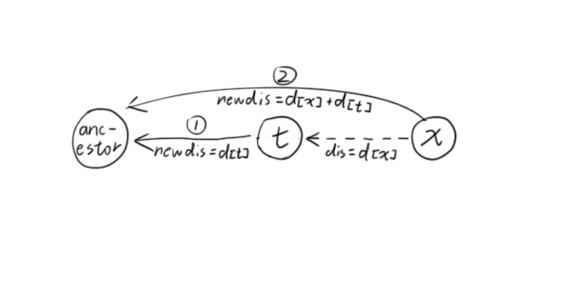
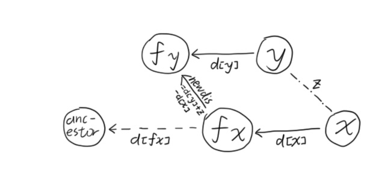

---
### 知识前置
#### 并查集
一个维护元素所属集合的数据结构，基本操作如下：
```cpp
int fa[N];
void init() {for (int i=1; i<=n; ++i) fa[i]=i;}
int find(int x) {return fa[x]==x?x:fa[x]=find(fa[x]);}
void merge(int x, int y) {fa[find(x)]=find(y);}
bool chk(int x, int y) {return find(x)==find(y);}
```
#### 递归算法
详见[OI-Wiki](https://oi-wiki.org/basic/divide-and-conquer/#%E9%80%92%E5%BD%92)。

---
### 写在前面
如果你将`merge`函数单独写，并且RE了，不妨检查一下你的`merge`函数返回类型。
```cpp
int merge(int x, int y) {fa[find(x)]=find(y);} // 你可能写成了这样
```

---
### 算法定义
在对并查集进行路径压缩和合并操作时，这些权值具有一定属性，即可将他们与父节点的关系，变化为与所在树的根结点关系。  
在并查集的边上定义某种权值、以及这种权值在路径压缩时产生的运算，从而解决更多的问题，这种算法叫带权并查集。

---
### 算法实现
以最普遍的维护到父节点距离为例。  
合并操作一般不以函数形式独立呈现，而是在主函数内。这里为了展示方便，独立写成了`merge()`函数。
#### 路径压缩
原理如图，`x`断开与`t`的联系，直接连到祖先根节点。  
  
```cpp
int find(int x) {
	if (fa[x]!=x) {int t=fa[x]; fa[x]=find(fa[x]), d[x]+=d[t];}
	return fa[x];
}
```
这段代码在原先路径压缩的基础上，添加了对$d$数组的维护操作。即在路径压缩时，将到父节点的距离额外加上父节点到父父节点的距离，递归后即可直接得到当前节点到根节点的距离。  
注意：一定要先记录`t`，完成对父节点的路径压缩后，再处理`x`，三个顺序不可颠倒。
#### 合并
原理如图，合并后`fx`断开与`fa[fx]`的连接，直接连接`fy`。路径压缩可由处理前的`find()`完成。  
  
```cpp
void merge(int x, int y, int z) {
	int fx=find(x), fy=find(y);
	d[fx]=d[y]+z-d[x], fa[fx]=fy;
}
```
这段代码在原先合并的基础上，添加了对$d$数组的维护操作。即在合并时，将$X$父节点的距离替换为到$Y$父节点的距离。
#### 判断合法性
```cpp
x=read(), y=read(), c=read(), fx=find(x), fy=find(y);
if (fx==fy) {
	if(d[x]-d[y]!=c) {++cnt; continue;}
} else merge(x, y, c);
```
判断已推导出的$x$与$y$的距离是否等于$c$。这里`fx==fy`意味着它们在同一集合内，可以判断关系；而`d[x]-d[y]`表示到父节点的距离差，即为两点距离差。  
注意，如果查询不保证类似左小右大的关系，**取绝对值**后再判断。

---
### 例题1
[洛谷P2024](https://www.luogu.com.cn/problem/P2024) [NOI2001] 食物链
#### 题目描述
$A$吃$B$，$B$吃$C$，$C$吃$A$。  
现有$N$个动物，以$1 \sim N$编号。每个动物都是$A,B,C$中的一种。  
给定两种关系：`1 X Y`表示$X$与$Y$是同类，`2 X Y`表示$X$吃$Y$。  
一共有$K$条描述关系的话，有的是真的，有的是假的。与前面冲突或不符合逻辑的是假话。输出假话的总数。

数据范围：$1\le N\le5\times10^4$，$1\le k\le1\times10^5$。
#### 解法1
扩展域并查集，开三倍空间，维护三个并查集。  
设$x$为自身，$x+n$为猎物，$x+2n$为天敌。  
对于$1$操作，如果$X$与$Y$互为猎物-天敌关系，则是假话；否则合并三组并查集，共享猎物与天敌。  
对于$2$操作，如果$X$与$Y$是同类，则是假话；否则合并三组并查集，建立猎物-天敌关系。
#### 代码
```cpp
#include <cmath>
#include <cstdio>
#include <cstring>
#include <iostream>
using namespace std;
typedef long long ll;

char buf[1<<20], *p1, *p2;
#define getchar() (p1==p2&&(p2=(p1=buf)+fread(buf,1,1<<20,stdin),p1==p2)?0:*p1++)

inline ll read() {
	ll x=0, f=1; char ch=getchar();
	while (ch<'0'||ch>'9') {if (ch=='-') f=-1; ch=getchar();}
	while (ch>='0'&&ch<='9') x=(x<<1)+(x<<3)+(ch^48), ch=getchar();
	return x*f;
}

#define N 1000010
int n, m, opt, t1, t2, ans, fa[N];
int find(int x) {return x==fa[x]?x:fa[x]=find(fa[x]);}
void merge(int x, int y) {fa[find(x)]=find(y);}

signed main() {
	// freopen("b.in", "r", stdin);
	n=read(), m=read();
	for (int i=1; i<=n*3; ++i) fa[i]=i;
	while (m--) {
		opt=read(), t1=read(), t2=read();
		if (t1>n||t2>n) {++ans; continue;}
		if (opt==1) {
			if (find(t1+n)==find(t2)||find(t1)==find(t2+n)) {++ans; continue;}
			merge(t1, t2), merge(t1+n, t2+n), merge(t1+n+n, t2+n+n);
		} else if (opt==2) {
			if (find(t1)==find(t2)||find(t1)==find(t2+n)) {++ans; continue;}
			merge(t1, t2+n+n), merge(t1+n, t2), merge(t1+n+n, t2+n);
		}
	}
	printf("%d\n", ans);
	return 0;
}
```

#### 问题
如果$N$很大，或者关系状态很多，不允许开$K$倍空间，这种办法就无效了。
#### 解法2
带权并查集，参照上方，有小变动。  
令`d[x]`表示当前节点与父节点的关系。具体的，`d[x]=0`表示$x$与父节点是同种生物，`d[x]=1`表示$x$是父节点的食物，`d[x]=1`表示$x$是父节点的天敌。  
状态只有三种，转移通过运算与取模实现。
路径压缩：`d[x]=(d[x]+d[t])%3`，其中$t$为$x$原父节点。  
合并：`d[fx]=c+d[y]-d[x]`，其中$c$表示$x$与$y$关系。

---
### 例题2
#### 题目描述
[洛谷P2294](https://www.luogu.com.cn/problem/P2294) [HNOI2005] 狡猾的商人

$T$组数据，每组给出序列长度$N$和$M$对数$l_i,\ r_i,\ s_i$，表示区间$[l_i,\ r_i]$的和为$S_i$，判断是否合法。

数据范围：$T\le100$，$N\le100$，$M\le1000$。
#### 解法
将区间和视作到父节点的距离`d[i]`，即$sum\ fa[i]\sim i-1$。  
路径压缩：`d[x]+=d[t]`，其中$t$为$x$原父节点。  
合并：`d[fx]=d[y]+z-d[x], fa[fx]=fy`。

注意这里需要`l--`。
#### 代码
```cpp
#include <cmath>
#include <cstdio>
#include <cstring>
#include <iostream>
using namespace std;
typedef long long ll;

char buf[1<<20], *p1, *p2;
#define getchar() (p1==p2&&(p2=(p1=buf)+fread(buf,1,1<<20,stdin),p1==p2)?0:*p1++)

inline ll read() {
	ll x=0, f=1; char ch=getchar();
	while (ch<'0'||ch>'9') {if (ch=='-') f=-1; ch=getchar();}
	while (ch>='0'&&ch<='9') x=(x<<1)+(x<<3)+(ch^48), ch=getchar();
	return x*f;
}

#define N 5010
int T, n, m, l, r, v, fr, f2;
int fa[N], d[N]; bool flag;

int find(int x) {
	if (fa[x]!=x) {int t=fa[x]; fa[x]=find(fa[x]), d[x]+=d[t];}
	return fa[x];
}

signed main() {
	// freopen("d.in", "r", stdin);
	T=read();
	while (T--) {
		n=read(), m=read(), flag=0;
		for (int i=0; i<=n; ++i) fa[i]=i, d[i]=0;
		while (m--) {
			l=read()-1, r=read(), v=read(), fr=find(l), f2=find(r);
			if (fr==f2&&d[l]+v!=d[r]) flag=1;
			d[f2]=d[l]+v-d[r], fa[f2]=fr;
		}
		puts(flag?"false":"true");
	}
	return 0;
}

```

---
### 例题3
#### 题目描述
[HDU 3047](https://acm.hdu.edu.cn/showproblem.php?pid=3047) Zjnu Stadium
[Source](https://blog.51cto.com/u_15127607/3619803)

$n$个人坐在体育馆里，给出$m$个他们之间的距离`A B X`，表示$B$的座位比$A$多$X$。求有多少条错误的关系。

数据范围$N\le5\times10^4$，$M\le1\times10^5$。
#### 解法
到父节点的距离`d[i]`，维护同上。  
路径压缩：`d[x]+=d[t]`，其中$t$为$x$原父节点。  
合并：`d[fx]=d[y]+z-d[x], fa[fx]=fy`。
#### 代码
```cpp
#include <cmath>
#include <cstdio>
#include <cstring>
#include <iostream>
using namespace std;
typedef long long ll;

#define N 50010
int n, m, a, fa1, b, fb, c, cnt;
int fa[N], d[N];

int find(int x) {
	if (fa[x]!=x) {int t=fa[x]; fa[x]=find(fa[x]), d[x]+=d[t];}
	return fa[x];
}

signed main() {
	// freopen("c.in", "r", stdin);
	while (scanf("%d%d", &n, &m)!=EOF) {
		for (int i=1; i<=n; ++i) fa[i]=i, d[i]=0; cnt=0;
		while (m--) {
			scanf("%d%d%d", &a, &b, &c), fa1=find(a), fb=find(b);
			if (fa1==fb) {
				if(d[b]-d[a]!=c) {++cnt; continue;}
			} else fa[fb]=fa1, d[fb]=c+d[a]-d[b];
		}
		printf("%d\n", cnt);
	}
	return 0;
}

```

---
### 总结
统计方案数等计数问题、查询矛盾等逻辑问题可能是用并查集做。  
考察朴素并查集的概率比较少，大多都是加权并查集或扩展域并查集。

加权并查集可以维护到父节点的信息，会在路径压缩过程中处理。
